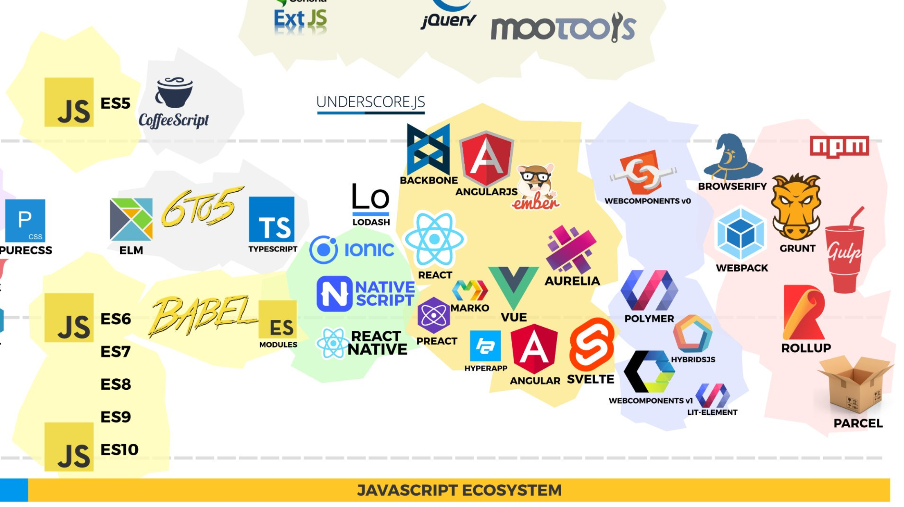
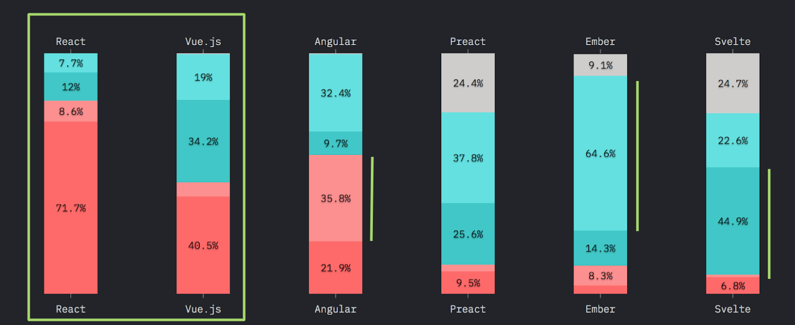
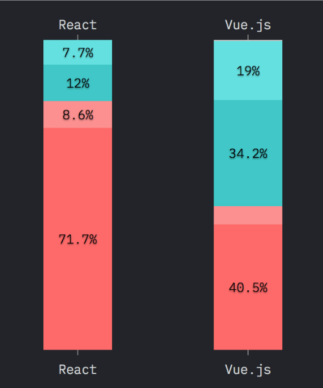
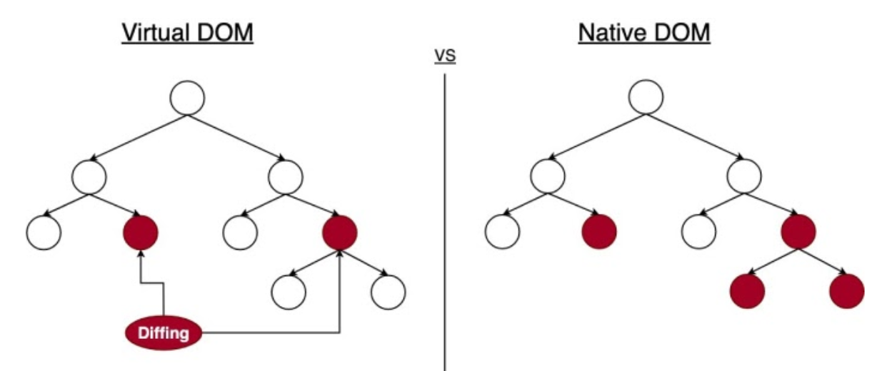
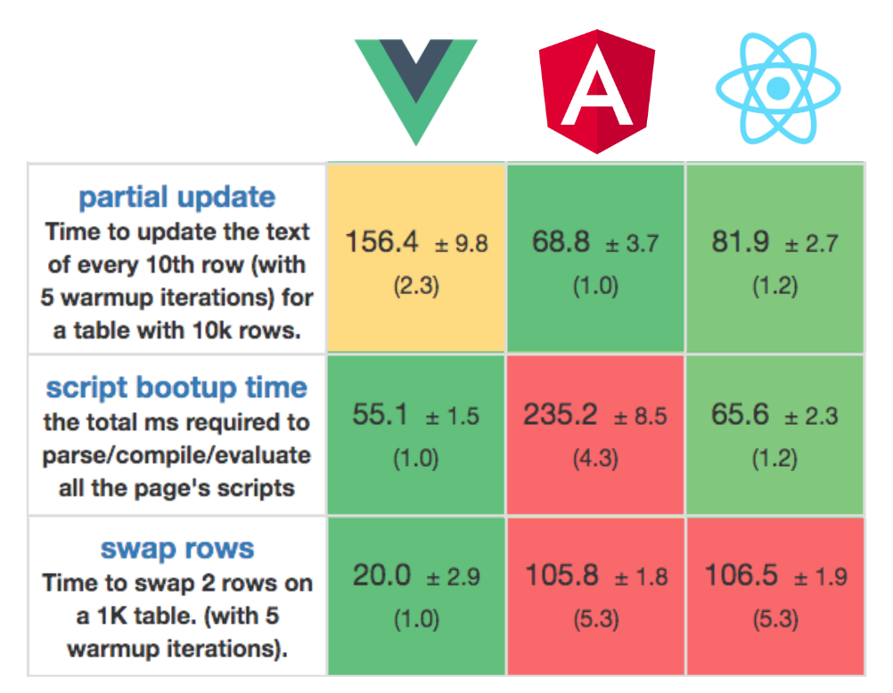
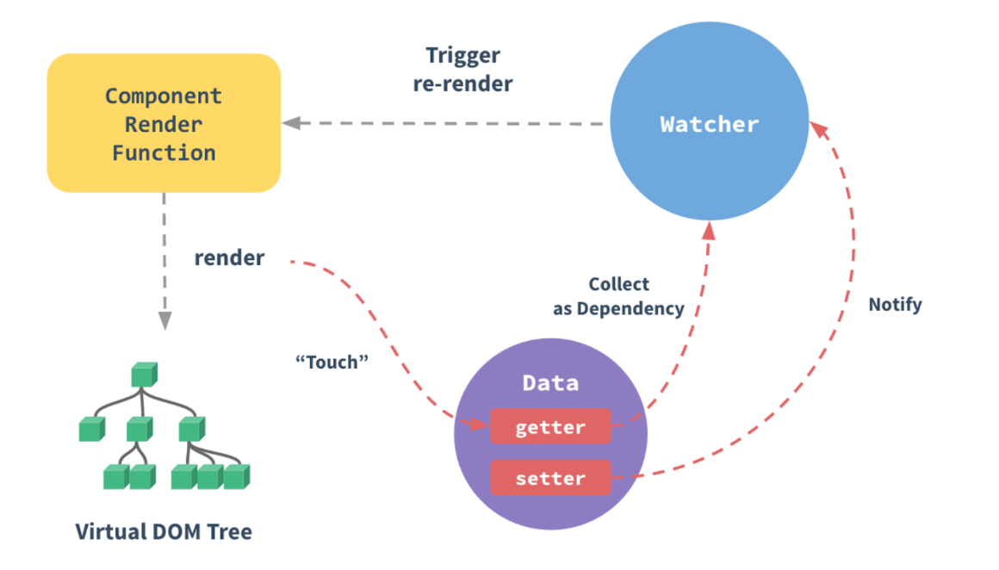
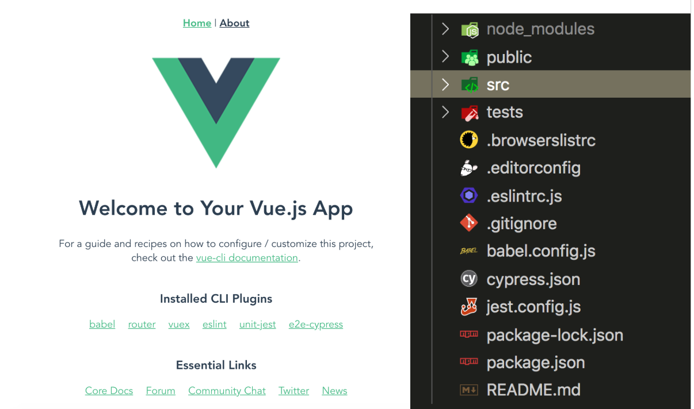
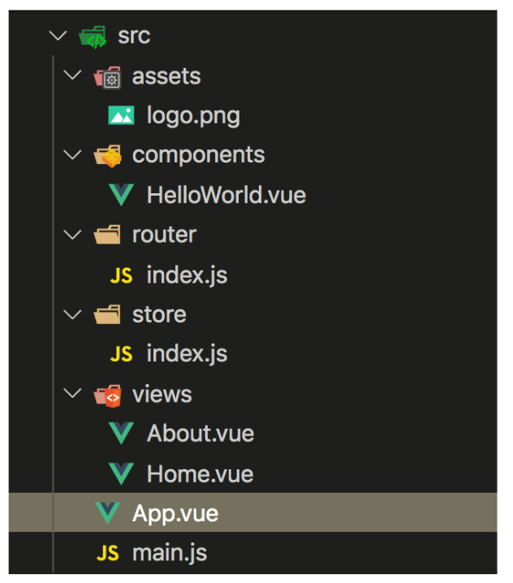
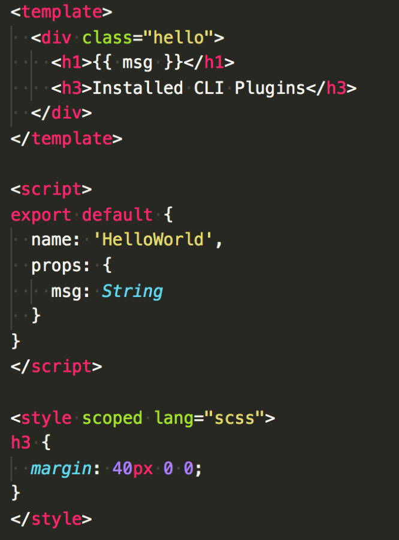

# Curso de Vue.js + Vuex

## CLASE 1

**Descubriendo Vue.js**

* ¿Qué es Vue?
* Un poco de historia
* Ventajas / Inconvenientes

**Getting Started**

* Instalando vue-cli
* Templates de Vue.js
* Creación de proyecto
* Arquitectura de proyecto
* Herramientas de desarrollo

### NORMAS E INFORMACIÓN DE INTERÉS

* Puntualidad
* Líquidos y comida
* Descansos
* Cafetería

### SOBRE MÍ

* Cristina Ponce
* Frontend developer en Kairós DS
* Web components, HTML, CSS, JS.
* Angular, React, Vue
* [@cristinagrim](https://twitter.com/CristinaGrim)

### SOBRE EL CURSO

* Teoría + práctica
* Curso progresivo
* Repositorio Github
* Presentaciones
* Ejercicios

### TEMARIO

* Descubriendo Vue.js
* Getting Started
* Componetización
* Directivas
* Styling
* Vue Router
* Vuex
* Testing
* Buenas prácticas
* Ecosistema

## Descubriendo Vue.JS 😱

### FRONTEND: HTML, CSS Y JS

Todos sabemos que el mundo frontend tiene una base muy importante que todos debemos conocer para poder trabajar con cualquier tecnología, pero especialmente con Vue.

De hecho, en la propia documentación de Vue podemos leer que es necesario haber trabajado con HTML, CSS y JS para poder continuar leyendo.

=================

La guía oficial asume conocimientos de nivel intermedio de HTML, CSS y JavaScript. Si usted es totalmente nuevo en el desarrollo frontend, puede que no sea la mejor idea saltar directamente a un framework como su primer paso - ¡capte lo básico y luego vuelva! La experiencia previa con otros frameworks ayuda, pero no es necesaria.

=================

### EVOLUCIÓN FRONTEND

En la siguiente imagen creada por [@Manz](https://twitter.com/Manz) podrás ver cómo ha ido desde 1995 hasta hoy (2019) la evolución de tecnologias relacionadas con el mundo frontend.


[Tweet evolución Frontend](https://twitter.com/Manz/status/1147556619833806849?s=20)

Por un lado, tenemos que el ecosistema HTML ha ido desde definir el estándar HTML4 a llegar a definir HTML5 gracias a W3C que las organización que se encarga de ayudar a definir los estándares a seguir en este sentido. Durante los últimos 10 años han surgido diferentes tecnologías para generar HTML con ayuda de un compilador. Estas tecnologías son: Markdown, Yaml, Handlebars, Jade, PUG, JSX, LIT-HTML.

LIT-HTML, concretamente es el motor para hacer templating dinámicos de LIT-ELEMENT, una librería muy ligera y sencilla de utilizar.

JSX, es el sistema de templating que utiliza React para generar HTML a partir de una función de renderizado.

Por un lado, tenemos el ecosistema CSS donde podemos ver que se generó el estándar de CSS3. A partir de ahí surgieron varias necesidades por parte de los desarrolladores que nos llevaron a crear tecnologías como SASS, LESS o Stylus. Que esencialmente son preprocesadores que nos permiten hacer nuestro CSS con algunas funcionalidades extra como crear variables comunes de CSS que podemos usar a lo largo de todos nuestros proyectos. Crear mixins para funcionalidad común dentro de nuestro CSS, etc. Gracias a este tipo de tecnologías el estándar CSS ha sido empujado, de cierta forma, para permitirnos crear variables con CSS nativo, entre otras cosas que estas herramientas nos habían bridando.

En cuanto a la compatibilidad con otros navegadores hemos podido contar con la ayuda de tecnologías como POSTCSS o autoprefixer, que nos han ayudado a compatibilizar nuestro CSS con los navegadores con los que queremos ser compatibles y que podemos definir a día de hoy en nuestra browserlist.

Relacionado con el CSS también han surgido diferentes metodologías para poder trabajar todos de una misma forma las más conocidas son SMACSS o BEM, pero hay algunas más definidas.



Por último, y no por ello menos importante, podemos ver la evolución que ha vivido el ecosistema Javascript que en comparación con HTML y CSS es considerablemente más significativo su cambio. Sobre todo, durante los últimos 10 años.

Podemos ver por una lado que en 1997 fue lanzada la primera versión de estándar de Javascript ES1, y que conforme iban pasando los años se iban haciendo algunos cambios pero muy poco significativos hasta llegar a la versión ES6 que fue lanzada en 2015 y de la que vinieron grandes cambios en el lenguaje. Pero estos cambios no solo sirvieron para actualizar el lenguaje a las necesidades de los desarrolladores y nuevos navegadores, si no también, para hacernos sentir más cómodos trabajando con Javascript.

Esto provocó que de repente, todos quisiéramos seguir el nuevo estándar y trabajar de una forma más cómoda y común en los equipos. Además, ha provocado que desde entonces la organización ECMA se ha dedicado cada año a sacar una nueva versión del lenguaje hasta haber llegado al estándar ES10, lanzado en 2019.

Debemos decir que tecnologías como Babel, Typescript o Webpack son grandes protagonistas de que estos cambios se hayan dado, puesto que en base a nuestras necesidades como desarrolladores se han ido generando tecnologías que nos permitían trabajar con lo que necesitamos.

Relacionado con los WebComponents también podemos decir que el estándar ha ido avanzando de forma continuada gracias a tecnologías como Polymer o LitElement, que han conseguido practicamente que esta tecnología sea entendida y compatible con todos los navegadores modernos sin apenas utilizar polyfills.

Por último, la evolución del ecosistema JS ha llevado a la generación de gran cantidad de librerías y frameworks que nos han permitido hacer proyectos de todo tipo según nuestras necesidades como profesionales. Cabe destacar el fuerte impacto de jQuery en el sector y la posterior generación de tecnologías como: AngularJS, Ember, Backbone, React, Preact, Angular, Vue o Svelte.

Resumiendo la evolución frontend en los últimos años ha sido:

**2010 - 2019**

* Estándares de Javascript: ES5 - ES10
* Babel, Typescript, Webpack...
* Webcomponents, Polymer, LitElement…
* Backbone, AngularJS, Ember, Angular, React, Vue...

### EVOLUCIÓN FRONTEND

Además de todas las tecnologías que han ido surgiendo durante estos años, también han surgido varios conceptos que debemos tener en cuenta para entender en qué punto entra Vue en juego.

#### JAMStack

**Javascript, APIs and Markup**

Esencialmente se trata de un nuevo concepto que implica la utilización de markup estático (HTML), Javascript en el lado del cliente y APIs.
Para poder trabajar con un proyecto de este tipo no se necesita un backend definido, solo un lugar donde *hostear* tipo Github o Netlify.

#### Static Web

**HTML, CSS, JS**

Se trata de una forma de trabajar que cualquier desarrollador seguro que ha utilizado en cualquier momento. Se trata de crear una web estática, que como su propio nombre indica es estática, esto quiere decir que conforme pase el tiempo no va a haber grandes cambios en su contenido.

Se trata de un desarrollo especialmente sencillo, puesto que solo supone la creación de HTML para definir el contenido de la página, CSS para darle estilo y forma acordes y JS muy básico para aportar dinamicidad al proyecto.

Este tipo de proyecto es muy aconsejable si el contenido de la página no va a cambiar mucho, se trata de un sitio web pequeño y la interacción que precisamos de Javascript es muy básica.

#### SPA

**Angular, React, Vue**

SPA o single page aplication, se trata de un concepto muy conocido por ser ejecutado en cliente y por no hacer recargas del navegador cuando el usuario cambia de ruta dentro de la misma aplicación.

Al contrario que el anterior, este tipo de aplicaciones también se caracteriza por tener contenido dinámico e información asíncrona que viene desde un servidor o APIs externas.

Este tipo de aplicaciones tiene un problema muy importante y es que el contenido no es indexable por los crawlers como Google. Aunque han avanzando durante estos años su forma de indexar contenido que depende de la carga de contenido asíncrono y Javascript a día de hoy, no es seguro que indexe tu contenido adecuadamente. Por ello, es importante que se tenga en cuenta esta característica para elegir una tenología u otra.

Este tipo de proyecto es aconsejable si no necesitas un buen SEO, si se trata por ejemplo de un backoffice. Si quieres tener una buena performance, crear componentes reutilizables y mantener un estado entre rutas.

#### Pre-rendering SPA

**Nuxt, Gatsby, VuePress**

Este tipo de proyecto es similar al anterior, la principal diferencia es que se trata de una SPA estática puesto que lo que hacemos es publicar la build generada en nuestro hosting. Además, ofrece una buena performance y el contenido sí que permite ser indexado por los crawlers como Google.

Una pre-rendering SPA es interesante si necesitas una buena herramienta para hacer SEO, si quieres tener una buena performance, mantener un estado entre rutas de tus usuarios y crear componentes reutilizables.

#### SSR

**Nuxt**

SSR, no es un concepto nuevo, es un concepto que existe practicamente desde los inicios del mundo del desarrollo. Básicamente la idea que esconde es el renderizado del sitio web en el servidor, que es lo que necesitamos esencialmente para trabajar por ejemplo con PHP, este lenguaje ha de ser interpretado para acabar mostrando el HTML que este tipo de ficheros incluye.

La idea de SSR en el lado frontend es esencialmente el renderizado de nuestros componentes en el servidor como HTML strings, que posteriormente son enviados al navegador y finalmente son 'hidratados' o completados con la interactividad agregada en nuestra app en cliente.

Cabe destacar que este tipo de proyectos va a precisar de un servidor que pueda funcionar con node y javascript puesto que cada vez que un usuario entra en nuestra página, ésta es generada en tiempo real. Este tipo de aplicaciones pueden ser consideradas isomorficas o universales porque el código puede ser ejecutado en servidor y en cliente.

La funcionalidad principal que nos va a ofrecer este tipo de proyecto es tener un buen SEO aunque el contenido de la aplicación cambie dinámicamente frecuentemente. Puesto que se va indexar cada vez que su contenido cambie. Además, nos va a permitir tener una buena performance, mantener un estado entre rutas y la generación de componentes reutilizables.

#### PWA

**Javascript**

Para poder convertir una aplicación de las hasta ahora definidas en una Progressive Web Application (PWA) solo tenemos que plantearnos si queremos ofrecer nuestro contenido al usuario aunque esté offline. Queremos que sea instalable como si de una aplicación nativa se tratase. Poder enviar notificaciones al usuario cuando haya alguna novedad.

Por otro lado, aprovechando que se trata de una aplicación de este tipo también sería interesante aprovechar la caché de recursos que se puede habilitar con un service worker y de esta forma hacer que haya una sincronización con nuevo contenido solo cuando nosotros queramos o inclusive controlando cuando el usuario esté disponible.

### FATIGA FRONTEND

Es normal que tras dar este repaso a la evolución del mundo frontend en los últimos años, tanto a nivel de tecnologías de los tres ecosistemas: HTML, CSS y Javascript. Como de las distintas formas de crear proyectos que han ido surgiendo últimamente, te encuentres con la ya conocida 'fatiga' frontend.

Y empiezas a sentirte un poco perdido ante todas las opciones que hay. Pero no te preocupes que llega Vue.JS al rescate, es la tecnología que has elegido para formarte en este curso y es la tecnología que te va a permitir hacer de una forma u otra los distintos tipos de proyectos de los que hemos hablado anteriormente:

* Static Web (Vue como librería)
* SPA (Vue como framework)
* Pre-rendering SPA (Vue vitamiando con Nuxt o VuePress)
* SSR (Nuxt como framework de Vue)
* PWA (Con Vue aunque realmente con cualquier tecnología)

### STATE OF JS

State of JS es una encuesta que se realiza todos los años, esta es su cuarta edición, a todos los desarrolladores del mundo que quieran responderla para contar desde su punto de vista como está el sector tecnológico y ayuda a todos a hacernos una idea de donde está yendo a nivel general el mundo frontend.

Este año ha sido respondida por 21,717 desarrolladores de todo el mundo. Y nos ha dado nuevamente una nueva visión de todo. He extraído algunos datos que considero clave para evaluar donde está la posición de VueJS dentro del sector pero puedes ver la encuesta al completo [aquí](https://2019.stateofjs.com)

Para poder extraer una visión general de la situación actual de los distintos frameworks frontend, puedes echarle un vistazo a esta gráfica que puedes ver en este apartado de la [encuesta](https://2019.stateofjs.com/front-end-frameworks/#front_end_frameworks_section_overview).



Donde podemos destacar que:

- **Angular**: Es el framework con mayor ratio de personas que han trabajado con esta tecnología y no les gustaría seguir trabajando con ella (35.8%).

- **Ember**: Es el framework del que un gran número de personas ha oído hablar de él y sin embargo, no le ha despertado curiosidad querer trabajar con esta tecnología (64.6%).

- **Svelte**: Es la librería que más expectativas está despertando en estos momentos, la gente está oyendo hablar de ello y está surgiendo la curiosidad para trabajar con esta tecnología (44.9%).



En la imagen anterior podemos ver concretamente la comparativa de qué piensa la gente sobre React y Vue. Donde muy resumidamente podemos destacar que:

- Vue es un fuerte competidor de React
- Vue tiene el mayor ratio de gente interesada en utilizarlo
- Vue es el segundo con mayor ratio de utilización y satisfacción, después de React.
- En comparación con el resto de tecnologías mencionadas previamente son React y Vue los que más destacan

Para ver en detalle la opinión generalizada de Vue, puedes visitar este enlace de la [encuesta](https://2019.stateofjs.com/front-end-frameworks/vuejs/)

#### POR QUÉ GUSTA VUE?

En la encuesta del [año pasado](https://2018.stateofjs.com/front-end-frameworks/vuejs/) pudimos ver en concreto cuáles son aquellas cosas por las que Vue está gustando tanto. Esencialmente son los siguientes puntos:

- 👶 Curva de aprendizaje
- 📖 Buena documentación
- 🎈 Simple y ligero
- ⚡ Buena performance
- 🔧 Buenas herramientas de desarrollo
- 🎁 Ecosistema de paquetes muy completo
- 📉 Aumento de popularidad

#### POR QUÉ ME GUSTA VUE?

- ✔️ Back to the basics: HTML, CSS, JS
- ✔️ Flexible - Proyecto / Equipo
- ✔️ Orientado a componentes - Modularización!
- ✔️ Curva de aprendizaje
- ✔️ Focalizar en la lógica del proyecto

#### QUÉ ES VUE?

Según el uso que le demos a esta tecnología realmente podremos utilizarla tanto como librería que como framework progresivo. De hecho, podremos ir iterando sobre nuestro proyecto en base a las necesidades que vayamos teniendo y nos va a permitir lanzar un proyecto con lo más básico y poco a poco ir progresando tecnológicamente en base a nuestras necesidades con otras librerías relacionadas:

- Vue-router
- Vuex
- Vue-cli
- Vue-press
- Nuxt
- Vuetify / Keen UI
- Nativescript-Vue
- Electron

#### UN POCO DE HISTORIA

**Evan You**
Creador de VueJS - 2014
Desarrollador en proyectos de Google, AngularJS y MeteorJS.
Que tenía una necesidad dentro de su proyecto: Crear una herramienta de render ligera.
Y que sin querer le llevó a crear VueJS.

=================

En primer lugar, teniendo en cuenta que hacer cambios en el DOM es algo muy costoso. Se planteó la opción de crear una copia en memoria del DOM, que hoy en día conocemos como Virtual DOM.

Para conseguir un mejor rendimiento bastaría con crear un proceso de *diffing* que comparase en base a los cambios generados el DOM real y el virtual DOM, de forma que solo se modificase los nodos realmente afectados.

Si lo piensas tiene sentido.



En la imagen anterior podemos ver cuál es el comportamiento natural del DOM frente a los cambios aplicados con ayuda del virtual DOM y un proceso de diffing eficiente.

- En el **DOM Nativo**: cuando un cambio surge en un nodo todos los componentes que estén a nivel jerarquico por debajo se ven obligados a ser actualizados.

- En el **virtual DOM**: cuando un cambio surge en un nodo solo afecta a ese nodo. En ningún caso se ven obligados a ser actualizados los componentes inferiores.

### UNA PEQUEÑA COMPARATIVA

#### Vue vs React

Llegado este punto resulta interesante hacer una comparativa real entre Vue y React:

Ambas tecnologías tienen en común:

- Virtual DOM
- Reactivos
- Componetización
- Tamaño
- Performance
- Core + Addons

React por un lado, es todo Javascript, sus templates se escriben con JSX, el CSS es CSS-in-JS, tiene una curva de aprendizaje un poco superior a la de Vue y su sistema de reactivad es en cascada con el DOM nativo.

Vue por otro lado, nos permite escribir HTML como template de nuestros componentes, CSS y Javascript nativo. De hecho, en la versión 3 de Vue, nos ofrece la posibilidad de trabajar con Typescript pero es opcional. Y su sistema de reactividad se cumple a nivel específico, solamente en los nodos afectados.

#### Vue vs Angular

Y como no podía ser de otra manera también debemos hacer una comparativa real entre Vue y Angular:

Por un lado, ambas tecnologías tienen en común una buena performance y la opción de poder crear componentes y modularizar así nuestro código.

Angular, es una tecnología que nos obliga a trabajar con Typescript desde el principio aunque en las últimas versiones es menos estricto en este sentido. Es una tecnología bastante más pesada que Vue, puesto que pesa ~65kb y su curva de aprendizaje es considerablemente superior a la de Vue.

Vue, por otro lado, es una herramienta muy ligera. Su core pesa alrededor de 20kb y con la utilización de la librería oficial de enrutado y gestión del estado puede llegar a crecer hasta 30kb. Además, en comparación con Angular es una herramienta flexible que se adapta practicamente a cualquier tipo de proyecto o equipo.

#### Benchmark

En la siguiente [página](https://stefankrause.net/js-frameworks-benchmark8/table.html) puedes encontrar una comparativa más exhaustiva de cómo reaccionan las diferentes tecnologías a cambios más drásticos.

Cabe destacar que las tecnologías que hemos comparado previamente: Angular, React y Vue, en general, tienen una muy buena performance. Donde se ve una diferencia más clara entre estas tecnologías es en la siguientes operaciones:



- **Actualización parcial**. Una operación que implica la actualización de una fila por cada 10 filas en una tabla de 10.000 filas. Donde se ordenan de más óptimos a menos: Angular, React y Vue.

- **Tiempo de arranque**. La inicialización de la aplicación, un proceso que implica parseo, compilado y evaluación de los scripts propios de la tecnología. Donde se ordenan de más óptimos a menos: Vue, React y Angular. Dónde Angular destaca por tener una optimización muy mala en este sentido en comparación con las otras dos tecnologías.

- **Intercambiar filas**. Una operación que implica el intercambio de dos filas en una tabla de 1000 filas. Donde se ordenan de más óptimos a menos: Vue, Angular y React. Dónde Vue destaca por ofrecer una marca considerablemente inferior a las otras dos tecnologías.

## Getting started 🖖

### Por donde empezamos...

- git
- node + npm
- Visual Studio Code + Vetur + Vue VSCode Snippets
- Google Chrome + Vue Dev Tools

### Tipo de proyecto

- **Componentes + Reactividad** --> VueJS

- **Componentes + Reactividad + Routing** --> VueJS / vue-router

- **Componentes + Reactividad + Routing + Estado** --> VueJS / vue-router / vuex

- **Componentes + Reactividad + Routing + Estado + SEO** --> VueJS / vue-router / vuex / SSR

Para nuestro primer contacto con esta tecnología vamos a hacer uso de VueJS como librería y aprender a sacar el máximo partido de la reactividad y los componentes de la misma.

### Vue como librería

Vamos a crear un fichero html.

```html
<!DOCTYPE html>
<html lang="en">
<head>
   <title>My first vue application</title>
</head>
<body>
<div id="app">
    {{ message }}
</div>
</body>
</html>
```

Vamos a agregar un script con el cdn de Vue.

```html
<script src="https://cdn.jsdelivr.net/npm/vue"></script>
```

Vamos a crear nuestro primer script con Vue.
En este código lo único que vemos es que estamos creando una instancia de Vue con `new Vue()`
Que estamos anclando la instancia de Vue a partir del nodo con `id="app"`
Y dentro de nuestro modelo de datos `data`, estamos agregando el atributo `message` que ha sido bindeado al elemento de html que incluye las llaves `{{ message }}`.

```html
<script>
       const app = new Vue({
           el: '#app',
           data: {
               message: 'Hello...'
           }
       })
</script>
```

Una vez has hecho este pequeño ejercicio:

1. Abre la consola del navegador.
2. Inspecciona el contenido de la variable app
3. Modifica el valor de *message*
4. Agrega un input que manipule esa misma variable

```html
<input type="text" v-model="message" />
```

[Ejemplo 1](https://codesandbox.io/s/vue-as-library-zin58)
[Ejemplo 2](https://codesandbox.io/s/vue-as-library-input-tj1e6)

### Reactividad

#### ¿Qué ha pasado?

- DATA & DOM están enlazados.
- Se han definido unas dependencias entre sí.
- Ahora todo es reactivo.
- Si hay cambios en el DATA, el DOM se actualiza.

(*) Painting / Rendering Es interesante echar un vistazo a las herramientas de desarrollo, a la sección de rendering con la sección de paint flashing activa para ver que está pasando en cada momento.



En la imagen podemos ver como funciona la reactividad en Vue, que esencialmente el flujo que sigue es el siguiente:

1. Generamos una instancia de Vue como su opción `data``
2. Vue recorrerá todas sus propiedades y las convertirá en getters/setters
3. Que le permitirá a Vue realizar seguimiento de las dependencias que se hayan generado
4. Notificará los cambios cuando las propiedades son accedidas o modificadas
5. Lo que generárá que el componente se renderice de nuevo

#### Precauciones

Hay una serie de causísticas a tener en cuenta con el sistema de reactividad actual de Vue.

- Por ejemplo, si se agrega o elimina una propiedad de un **objeto**.

```javascript
// BAD
vm.someObject.b = 2

// GOOD
Vue.set(object, propertyName, value)
Vue.set(vm.someObject, 'b', 2)
this.$set(this.someObject, 'b', 2)
```

```javascript
// BAD
Object.assign(this.someObject, { a: 1, b: 2 })

// GOOD
this.someObject = Object.assign({}, this.someObject, { a: 1, b: 2 })
```

Algunos cambios con los **arrays** tampoco son detectados automáticamente y no provocan un re-renderizado.

- Por ejemplo, si se setea un item con el index

```javascript
// BAD
vm.items[indexOfItem] = newValue

// GOOD
Vue.set(vm.items, indexOfItem, newValue)
```

- Por ejemplo, si modificamos la longitud del array manualmente

```javascript
// BAD
vm.items.length = newLength

// GOOD
vm.items.splice(indexOfItem, 1, newValue)
```

- Todas las propiedades que se quieran reactivas, deben ser **inicializadas** obligatoriamente. Si no, no existirán para Vue.

```javascript
data() {
    return {
        message: ''
    }
},
```

**VUE3, BYE BYE, REACTIVITY CAVEATS WELCOME PROXIES!**

Sí, así es. Estas precauciones deberás tenerlas en cuenta mientras estés utilizando la versión 2.x de Vue. Puesto que con el planteamiento nuevo del sistema de reactividad de Vue3 con proxies. Hará que te olvides de estas precauciones!

### Registro de componentes

Si queremos definir un componente a **nivel global**, para que se pueda utilizar dentro de toda la aplicación esta es la forma:

```javascript
Vue.component(name, config)
Vue.component('my-button', { template, data, ... })
```

Si queremos definir un componente a **nivel local**, bastará con importarlo y agregarlo en el nodo `components`:

```javascript
components: {
	myButton
}
```

Por último para poder utilizar dicho componente en nuestro HTML, es tan sencillo como escribirlo como si se tratase de un web component:

```javascript
<my-button/>
```

Para poder verlo en funcionamiento en un ejemplo, aquí tienes la forma de utilizar componentes:

- A nivel global: [Counter](https://codesandbox.io/s/vue-component-counter-5711w)
- A nivel local: [Counter](https://codesandbox.io/s/vue-counter-local-4zi01)

### EJERCICIO 1
#### Vue como librería

¡Vamos a crear nuestro propio **sombrero seleccionador**!

- Crea un array con las casas de Hogwarts en **data()**
- Crea un **botón** en el que al hacer clic saldrá una casa de forma random
- Agrega un **loader** con un temporizador de 5s para mostrar alguna animación mientras el sombrero se lo piensa

> Cosas que necesitar recordar:

> @click=”setHouse”

> methods: {
>	setHouse() { // Do something }
> }

[Solución](https://codesandbox.io/s/vue-harry-potter-sorting-hat-6womb)
[Demo](https://6womb.csb.app/)

### Vue como framework

Herramientas necesarias para poder seguir el curso adecuadamente:

- git
- node + npm
- Visual Studio Code + Vetur + Vue VSCode Snippets
- Google Chrome + Vue Dev Tools

Instalamos el cli de Vue:

```javascript
npm install -g @vue/cli
# OR
yarn global add @vue/cli
```

Para generar un proyecto con ayuda del CLI de Vue, podemos utilizar una herramienta visual o la configuración por consola. Siéntete libre de crear el proyecto como prefieras:

```javascript
vue ui
# OR
vue create project-name
```

En ambos procesos de configuración te aparecerán los siguientes elementos a configurar. Para ser tu primer proyecto con el CLI de Vue puedes configurarlo de la forma más sencilla posible:

```javascript
? Please pick a preset: Manually select features
? Check the features needed for your project: Babel, Router, Vuex, CSS Pre-processors, Linter, Unit, E2E
? Use history mode for router? No
? Pick a CSS pre-processor: Sass/SCSS (with node-sass)
? Pick a linter / formatter config: Standard
? Pick additional lint features: Lint on save
? Pick a unit testing solution: Jest
? Pick a E2E testing solution: Cypress
? Where do you prefer placing config for Babel, PostCSS, ESLint, etc.? 
In dedicated config files
```

```javascript
🎉  Successfully created project project-name.
👉  Get started with the following commands:

 $ cd project-name
 $ npm run serve
```

Lanzando estos comandos por consola ya deberías ver tu primer proyecto con Vue en el navegador.



Dentro de la estructura de carpetas podrás ver todos los ficheros de configuración del proyecto, una carpeta `tests`donde estarán todos los tests que generes, la carpeta `public` que es donde se ubica el html público y la carpeta `src` que es donde estará ubicado el core de tu proyecto.



Dentro de la carpeta `src` podrás encontrar:

- La carpeta `assets` que es donde ubicaremos imágenes y css estáticos.
- `components` como su propio nombre indica será donde ubicaremos los componentes de nuestra aplicación.
- `router` que será donde configuraremos nuestro enrutado en el futuro
- `store` que será donde configuraremos nuestro estado global en el futuro
- `views` que será donde ubicaremos los componentes de tipo vista
- `App.vue` que es nuestro componente principal
- `main.js`que es nuestro punto de entrada en la aplicación y dónde se crea la instancia de Vue

### Single File Components (SFC)

Los SFC son una de las características principales de Vue. Básicamente resumen la idea de que en un único fichero encontramos todo lo necesario y relacionado con un componente: **HTML, CSS y JS**



- **Template**: que es donde ubicaremos nuestro HTML. Debe ser lo más simple y declarativa posible. Es decir, no deben incluir lógica compleja, para eso tenemos las etiquetas de `<script>`.

- **Javascript**: en esta parte ubicaremos la lógica de negocio relacionada con el componente.

- **Style**: en función de si queremos que los estilos queden anclados solamente al componente, podemos poner el atributo "scoped" o no.

Algunas cosas a tener en cuenta relacionadas con los **SFC**:

HTML
- Debe ir entre etiquetas `<template></template>`
- Dentro del template debe existir un nodo que contenga todo, una única etiqueta.

JS
- Debe ir entre etiquetas `<script></script>`
- Debe tener un nombre para poder identificarlo fácilmente

CSS
- Debe ir entre etiquetas `<style></style>`

**Nombrado del componente:**

```javascript
HelloWorld.vue
name: ‘HelloWorld’
```

**Usando el componente:**

```javascript
Import HelloWorld from ‘@/components/HelloWorld’
<hello-world />
components: { HelloWorld }
```

### EJERCICIO 2
#### Vue como framework

¡Vamos a crear nuestro propio **sombrero seleccionador**!

- Recupera tu proyecto del sombrero
- Traslada tu proyecto a la nueva forma de trabajo (CLI)
- Engloba toda la funcionalidad en un componente que utilices en App.vue denominado **sorting-hat**
- Crea un componente para el botón **app-button** que incluya la funcionalidad random
- Estructura esperada: App.vue > SortinHat.vue > AppButton.vue

> Cosas que necesitar recordar:

> HelloWorld.vue

> name: ‘HelloWorld’

> Import HelloWorld from ‘@/components/HelloWorld’

> <hello-world />

> components: { HelloWorld }

[Solución](https://codesandbox.io/s/vue-harry-potter-sorting-hat-cli-q1oe4)
[Demo](https://q1oe4.csb.app/)

### RECURSOS

- [Evolución Frontend](https://twitter.com/Manz/status/1147556619833806849?s=20)
- [Tipo de proyecto según necesidades](https://marinaaisa.com/blog/cook-websites-based-on-your-needs)
- [Tutorial para construir una PWA](https://codelabs.developers.google.com/codelabs/your-first-pwapp/#0)
- [State of JS: Frontend frameworks](https://2019.stateofjs.com/front-end-frameworks/#front_end_frameworks_section_overview)
- [Charla Virtual DOM](https://www.youtube.com/watch?v=yFE4iWkrI2Y&t=1s)
- [Comparación entre frameworks](https://vuejs.org/v2/guide/comparison.html)
- [Benchmark Frameworks JS](https://stefankrause.net/js-frameworks-benchmark8/table.html)
- [Vue Reactividad](https://vuejs.org/v2/guide/reactivity.html)
- [Precacuiones de reactividad en listas](https://vuejs.org/v2/guide/list.html#Caveats)
- [Cómo funciona la reactividad en Vue](https://www.youtube.com/watch?v=axXwWU-L7RM)
- [Cómo implementan la reactividad React, Vue y Angular](https://www.youtube.com/watch?v=VyzlZl6LlqM)


