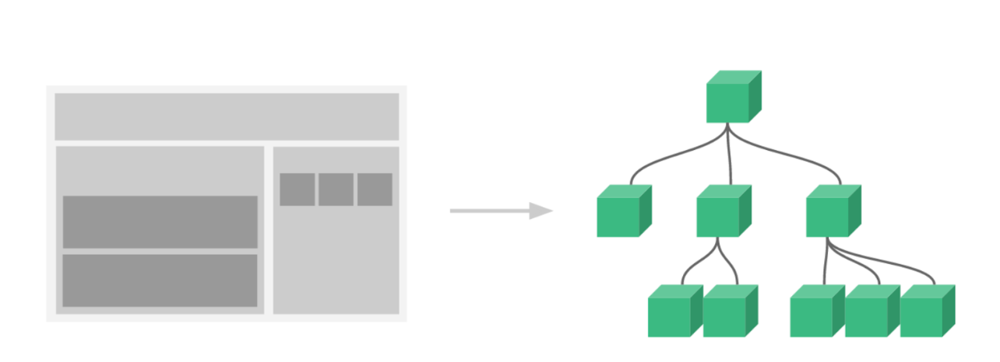
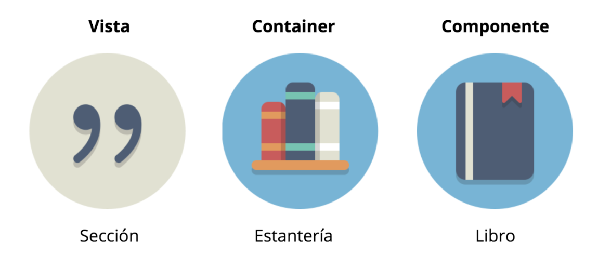
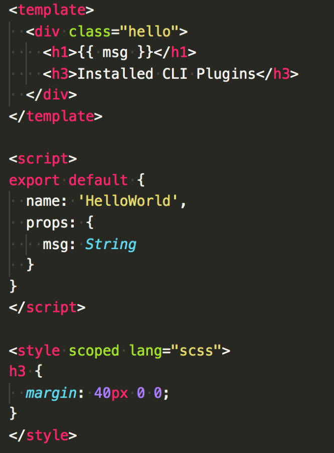
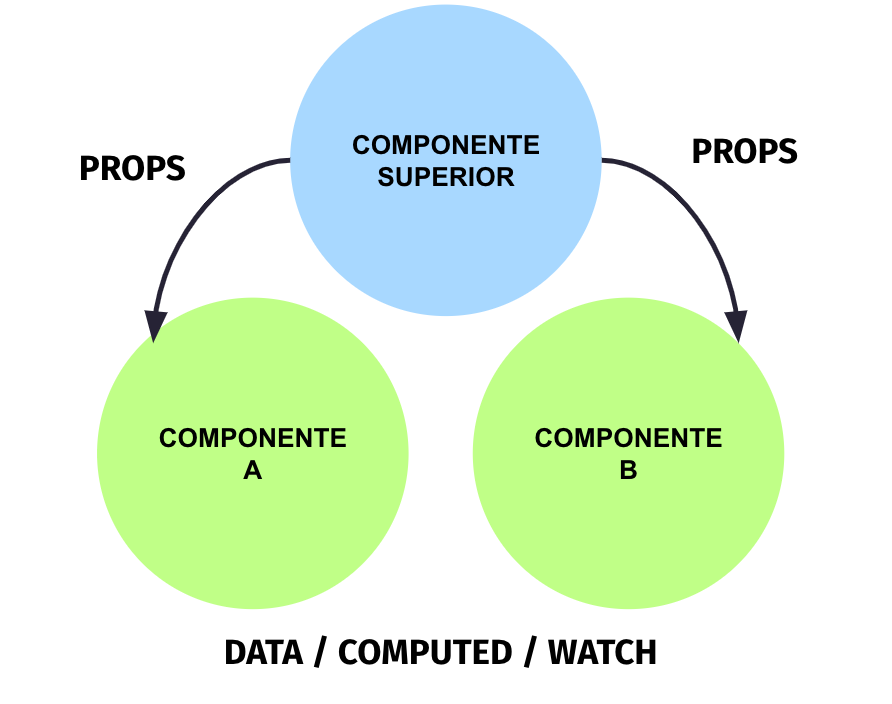
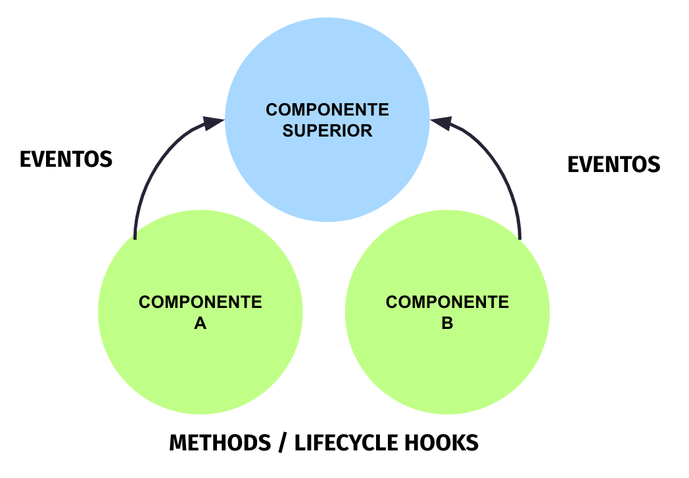

# Curso de Vue.js + Vuex

## CLASE 2

**Componentización**

* Definición de componentes
* Arquitectura basada en componentes
* Single File Components
* Atributos: Data, Computed, Watch, Props
* Métodos: Métodos, Ciclo de vida (Hooks) y emisión de eventos
* Mixins
* Slots
* Web components

### NORMAS E INFORMACIÓN DE INTERÉS

* Puntualidad
* Líquidos y comida
* Descansos
* Cafetería

## Componentización 😱

¿Qué entendemos por componente?

Todo elemento en nuestra aplicación que tiene **entidad propia** tanto a nivel visual como a nivel funcional.

¿Por qué queremos componentizar?

* Encapsula responsabilidad
* Reutilización de componentes
* Evita la repetición de código
* Separar la lógica de negocio de la estructura de datos
* Proyecto mantenible

Antes de empezar a crear componentes hay que tener en cuenta, que en Vue todo son componentes.



Y que para poder crear una arquitectura basada en componentes, antes debemos:

- **Analizar** cuáles son los componentes de la aplicación. Analizar los diseños que nos brinden de la plataforma a desarrollar, extraer patrones y así poder ver cuáles van a ser los componentes propios de la plataforma.

- Una vez hecho este análisis, podremos **crear** la arquitectura del proyecto en base a eso.



Teniendo en cuenta que en Vue todo son componentes debemos conocer bien los distintos tipos de componentes que tenemos. Haciendo uso de la metáfora de una biblioteca podremos ver que:

- Tenemos los **componentes de tipo vista (ruta)** que corresponden a una sección de la biblioteca. Que pueden contener componentes de tipo contenedores y componentes base.

- Los **componentes de tipo contenedor** corresponden a una estantería puesto que contiene varios libros, por tanto, es contenedor de varias componentes base. Nos permite orquestar varios componentes y nos permite estructurar el contenido.

- Los **componentes base**, son las unidades mínimas de nuestra aplicación. Son aquellos elementos que tienen identidad propia tanto a nivel visual como a nivel funcional. En la metáfora de la biblioteca corresponde a los libros.

Vamos a ver esto con un ejemplo. Si puedes accede a la página de [Medium](https://medium.com/) y analiza la página por estos niveles y piensa que componentes podrían ser vista, contenedores y componentes base.

A continuación te dejo algunas capturas de cómo podría ser la creación de componentes.


En la anterior imagen puedes ver qué podría englobar el componente vista, que es el espacio dónde se va renderizar el contenido que difiere en cada vista.

En este caso podríamos dejar header y footer fuera, puesto que son iguales en todas las rutas de la aplicación y no necesitamos renderizarlos de nuevo en cada acceso a la ruta.


En la anterior imagen puedes ver qué son específicamente los componentes contenedores, que son aquellos que contienen otros componentes.

Un ejemplo muy sencillo de entender es el componente del header que engloba el menú, que no deja de ser un listado de elementos, el logo, un buscador, las notificaciones del usuario y el acceso al perfil. Cada una de estas funcionalidades puede ser un componente independiente, un componente base. De ahí que el header o encabezado funciones como contenedor y manejador de su propia lógica.

Otros ejemplos de elementos contenedores podrían ser los grupos de contenido que se aprecian en la página: `<main>` `<aside>`, etc.


En la anterior imagen podemos definir las unidades mínimas de nuestra aplicación donde quedarían englobados los distintos artículos como tal que serían un único componente reutilizado en varias ocasiones.

Otros ejemplos de componentes base serían el menú de la página, el buscador con autocomplete, etc. En general cualquier componente con identidad propia.

### SFC - Single File Component

Para poder crear componentes es necesario recapitular el concepto de Single File Component (SFC), que pudimos ver en la anterior sesión.

Los SFC son una de las características principales de Vue. Básicamente resumen la idea de que en un único fichero encontramos todo lo necesario y relacionado con un componente: **HTML, CSS y JS**

El hecho de que esté todo en un único fichero, nos obliga a no crear componentes especialmente grandes. Y que de una forma muy sencilla nos va a permitir detectar cuando estamos creando componentes grandes y que podemos ir dividiendo en componentes más pequeños por bloques de funcionalidad.



- **Template**: que es donde ubicamos nuestro HTML. Debe ser lo más simple y declarativa posible. Es decir, no deben incluir lógica compleja, para eso tenemos las etiquetas de `<script>`.

- **Javascript**: en esta parte ubicamos la lógica de negocio relacionada con el componente.

- **Style**: en función de si queremos que los estilos queden anclados solamente al componente, podemos poner el atributo "scoped" o no.

### Referencias

Dentro de nuestros componentes podemos acceder a ciertas referencias que nos van a dar la información propia del componente en el que estamos.

Las referencias que podemos utilizar son las siguientes:

* **this** Es el componente. Da acceso a todos los atributos y métodos.

* **this.$el**: Es el nodo principal del componente.

* **this.$refs** Es un objeto que guarda los elementos que han sido referenciado con el atributo ref

```html
<button 
    ref="clearButton"
    type="button"
    @click="clearForm" />
```

```javascript

methods: {
    clearForm () {
        // Nos da acceso a todas las referencias creadas en el componente.
        this.$refs
        // Nos da acceso al botón que hemos referenciado con ref="clearButton"
        this.$refs.clearButton
    }
}
```

Dentro de los componentes de Vue tenemos atributos y métodos que nos va a permitir configurarlos según necesitemos.

### Componentización - Atributos

Dentro de los distintos **atributos** que puede tener un componente encontramos el siguiente diagrama. Que esencialmente nos permite discernir entre los atributos propios del componente base: **data**, **computed** y **watch**. Y los atributos que viajan de componentes superiores a inferiores denominadas **props**.



#### Atributos - Data

¿Qué es **data**? Es nuestro modelo de datos dentro del componente.

- Información local del componente. Es aquella información propia del componente.

- Pueden ser atributos estáticos o dinámicos, tanto si van a cambiar a lo largo del ciclo de vida del componente como si no.

Un ejemplo muy sencillo:

```html
<template>
 <div class="home">
   <h1>{{ title }}</h1>
 </div>
</template>
<script>
export default {
 name: 'home',
 data() {
   return {
     title: 'Probando'
   }
 }
}
</script>
```

En el ejemplo hemos definido dentro de data un atributo denominado `title` que ha sido renderizado dentro de las llaves `{{ title }}`.

Esta es la *magia* de la reactividad de Vue. Básicamente ahora tenemos nuestro modelo de datos y nuestro DOM enlazados. Se han definido unas dependencias entre sí y esto nos permite tener un atributo totalmente **reactivo**. De forma que si cambia su valor en algún momento, el componente será renderizado de nuevo.

Aunque como hemos comentado previamente, dentro de las etiquetas `<template>` deberíamos dejar el HTML lo más simple y declarativo posible.

En ciertas ocasiones puede que necesitemos ejecutar cierta lógica dentro de las llaves y esto es algo que está permitido, pero debe ser lógica sencilla. Como por ejemplo, concatenaciones, ternarios...

```javascript
{{ title }}

{{ number + 1 }}

{{ ok ? 'YES' : 'NO' }}

{{ message.split('').reverse().join('') }}
```

Antes de continuar, es importante que tengas en cuenta que no es lo mismo crear nuestro modelo de datos como objeto o como función.
```javascript
data: {
    title: 'Probando'
}
```

```javascript
 data() {
   return {
     title: 'Probando'
   }
 }
```

La principal diferencia es que si lo creamos como objeto estamos creando un objeto global que puede ser modificado a lo largo de toda la aplicación, lo que es un tanto peligroso y que solo debemos hacer si realmente es necesario. Mientras que si lo creamos como función es un modelo de datos local que queda anclado a nuestro componente.

#### EJERCICIO
##### Atributos - Data

¡Vamos a crear nuestro propio **DNI Mago**!

* Crea un nuevo proyecto con el CLI de Vue
* Crea un componente denominado **WizardCard** que utilices en App.vue
* Este componente debe incluir un **formulario** con los siguientes campos: name, alias, role, house, school, wand...
* Utiliza **v-model** para hacer que estos campos se queden bindeados.
* Refleja la información que introduce el usuario en una **tarjeta mágica** (diseño libre).

[Solución](https://codesandbox.io/s/vue-wizard-card-7oprx)

[Demo](https://7oprx.csb.app/)

#### Atributos - Computed

¿Qué es una **propiedad computada** o **computed**? Es una propiedad que depende de al menos otra propiedad para poder tener un valor.

- Observa una o varias propiedades

- Actualiza su valor dinámicamente cuando las propiedades de las que dependen son actualizadas

- Su valor es inicializado al crearse el componente

- Debe retornar siempre un valor

Vamos a verlo en un ejemplo:

Primero definimos en nuestro modelo de datos la información de la que dependemos. En este caso firstName y lastName.

```javascript
export default {
 data () {
   return {
     firstName: 'Cristina',
     lastName: 'Ponce'
   }
 },
}
```

Después componemos nuestra computada que depende de ambas para tener un valor y retornamos su valor.


```javascript
export default {
 computed: {
   fullName () {
     return this.firstName + ' ' + this.lastName
   }
 }
}
```

Hay dos formas de acceder a los atributos dentro de las computadas. Directamente, accediendo a `this` y su atributo. O como muestro a continuación, que es haciendo destructuring del componente y cogiendo solo aquello que queremos escuchar.

```javascript
export default {
 computed: {
   fullName ({ firstName, lastName }) {
     return firstName + ' ' + lastName
   }
 }
}
```

#### EJERCICIO
##### Atributos - Computed

¡El **callejón Diagon** admite pedidos online!

- Crea un nuevo proyecto con el CLI de Vue
- Crea un componente denominado **DiagonValley** que utilices en App.vue
- Este componente debe incluir un carrito de la compra ficticio de al menos tres productos **(data)**.
- Cada producto tendrá las **propiedades: title, quantity, price**.
- Crea una propiedad **computada para calcular el total** de la compra y mostrarlo en pantalla.

[Solución](https://codesandbox.io/s/vue-diagon-alley-w6e8o)

[Demo](https://w6e8o.csb.app/)

#### Atributos - Watch

¿Qué es un **observador o watch**? Es una propiedad que escucha otra propiedad para ejecutar lógica adicional cuando ésta cambia.

- Observa una propiedad

- Recibe el valor actual y el anterior como parámetros

- Su valor NO es inicializado al crearse el componente

- Permite ejecutar lógica cuando su valor se actualice

Vamos a verlo funcionar con un ejemplo:

Primero creamos el HTML con un input que va a permitirnos cambiar dinámicamente con v-model el valor de *km*, y mostramos dinámicamente en el DOM el valor de cm y mm calculado.

```html
<template>
 <div class="home">
   <label>KM: <input type="text" v-model="km"></label>
   <p>CM {{ cm }}</p>
   <p>MM {{ mm }}</p>
 </div>
</template>
```

A continuación, creamos nuestro modelo de datos inicializando los tres atributos: km, cm y mm.

```javascript
 data () {
   return {
     km: 0,
     cm: 0,
     mm: 0
   }
 },
```

Posteriormente, creamos nuestro watch, que va a escuchar km y en base a ese valor va a actualizar el valor de cm y mm.

```javascript
watch: {
   km (val) {
     this.cm = val * 100000
     this.mm = val * 1000000
   }
 }
```

[Ejemplo](https://codesandbox.io/s/convert-km-to-watch-1v6et)

Si bien es cierto que una de las características a tener en cuenta de los watchers es que no se inicializan a crear el componente. Hay una forma que nos permite inicializarlos de igual manera que las computadas y es con la propiedad: `immediate: true`.

Eso sí, para hacerlo funcionar deberemos crear el watch como un objeto, no como una función y ejecutar la lógica dentro de la función `handler()`.

```javascript
watch: {
   km: {
     immediate: true,
     handler (value) {
       this.cm = value * 100000
       this.mm = value * 1000000
     }
   }
 }
```

Es muy probable que en algunas ocasiones necesites observar cambios tanto en objetos como en arrays y tengas problema con el *watch* porque por defecto solo escucha cambios a un nivel. Es por ello, que se hace necesario el uso de la propiedad `deep: true`. Que precisamente te brinda la posibilidad de escuchar cambios en objetos y arrays anidados.

```javascript
watch: {
   km: {
     deep: true,
     handler (value) {
        this.cm = value * 100000
        this.mm = value * 1000000
     }
   }
 }
```

Por otro lado, los watchers son muy útiles si quieres escuchar cambios en una propiedad y que cada vez que ésta sea modificada lanzar una petición asíncrona que te retorne un valor.

Aquí tienes un ejemplo con la api de Harry Potter:

```javascript
watch: {
    async hogwartsHouse(value) {
        this.selectedHouse = await fetch('https://potterapi.com', { id: value });
    }
}
```

#### EJERCICIO
##### Atributos - Watch

¡Conoce la **historia de cada casa** online!

- Crea un componente denominado **HistoryHouse** que utilices en App.vue
- Este componente debe incluir un **dropdown** que permita seleccionar entre las 4 casas
- Cada casa tendrá asociado un **ID** que son los que te brinda el endpoint: /houses en https://www.potterapi.com/
- Cada vez que se cambie el valor del **dropdown** se debe hacer una petición nueva con el ID de la casa seleccionada.
- Crea un **API Key** aquí: https://www.potterapi.com/
- Gestiona cada nueva petición a través de un **watcher**
- Se debe mostrar la información de la casa en una **tarjeta virtual**

Ejemplo de petición:

```javascript
fetch(`https://www.potterapi.com/v1/houses/${HOUSE_ID}?key=${APY_KEY}`)
.then((response) => response.json())
.then((house) => this.house = house);
```

[Solución](https://codesandbox.io/s/history-house-2itsd)

[Demo](https://2itsd.csb.app/)

##### Computed vs Watch

Después de haber visto por primera vez las **propiedades computadas (computed)** y los **observadores (watch)** es normal que te surjan dudas de cuándo utilizar uno u otro.

| Computed                            | Watch                               |
| ----------------------------------- | ----------------------------------- |
| Sincronía                           | Asincronía                          |
| Retorna un valor                    | No retorna nada                     |
| Gestiona la caché                   | Ejecución de lógica                 |
| Depende de una o varias propiedades | Depende de una propiedad            |

Pero si revisas esta tabla y te quedas con la ideas clave enseguida te harás a la idea de cuándo utilizar uno u otro.

- Por ejemplo, si se trata de una cambio síncrono que se aplicará en el DOM la computada es tu solución. Sin embargo, si necesitas gestionar alguna petición asíncrona precisarás de un watch.

- Si necesitas obtener un resultado nuevo cada vez que una dependencia cambia, gestionar la caché y mostrarlo en el DOM la computada es tu aliada. Si por otro lado, el resultado te da igual pero quieres ejecutar lógica adicional por cada cambio en la propiedad de la que dependes, el watch es tu aliado.

- Si quieres escuchar más de una propiedad, necesitas una computada. Si necesitas escuchar solo una, el watch podría ser tu solución. Aunque atención al resto de puntos por si la computada te pudiera servir para este caso.

#### Atributos - Props

Las props tienen como objetivo principal: enviar información de componentes superiores a componentes inferiores.

De esta forma estamos enviado al componente `WizardCard.vue` dos props: title y likes con valor estático.

```javascript
<wizard-card title="Harry Potter" likes="40" />
```

Para recibir en el componente `WizardCard.vue` estas propiedades podemos definir las props en un array de Strings.

```javascript
props: ['title', 'likes']
```

Por otro lado, si queremos enviar al componente `WizardCard.vue` las mismas props pero con valor dinámico deberemos utilizar `v-bind:title or :title` para coger su valor dinámicamente.

```javascript
<wizard-card :title="card.title" :likes="card.likes" />
```

Y recibiremos de la misma forma, las props en nuestro componente.

```javascript
props: ['title', 'likes']
```

Las props pueden ser definidas de varias maneras. Pero es importante que tengas en cuenta que la forma en que las hemos definido previamente son muy útiles para prototipado simple, pero su uso de esta forma no es aconsejable para proyectos que van a estar en producción.

Teniendo en cuenta que es información que les viene dada desde fuera y de la que no tienen control los componentes. Lo correcto sería dejarlo lo más estricto posible.

En primer lugar, podemos ser estrictos en cuanto al tipado de este tipo de propiedades. De forma que si nos vienen una prop tipada en String, el componente espere un String.

```javascript
props: {
   title: {
     type: String,
   },
},
```

En segundo lugar, en caso de que nos interese, podemos ponerles un valor por defecto para que nuestro componente se comporte como esperamos.

```javascript
props: {
   likes: {
     type: Number,
     default: 0,
   },
 },
```

En tercer lugar, podremos definir si nuestra prop es requerida o no, para que en caso de que así sea nos avise para que siempre se la pasemos.

```javascript
props: {
   category: {
     type: String,
     required: true
   },
 },
```

Por último, y no por ello menos importante, tenemos la posibilidad de controlar los valores que enviamos desde la prop.

```javascript
props: {
   category: {
     type: String,
     validator(value) { 
        return ['active', 'inactive'].includes(value);
     },
   },
},
```

A continuación, tienes un ejemplo de validación de props real. 
[Ejemplo](https://codesandbox.io/s/vue-prop-validation-38l5i)

#### ¡IMPORTANTE!

En lo relativo a las props hay un par de puntos importantes a tener en cuenta y que te ayudarán a entender todavía mejor cómo funcionan las **props** en Vue:

- Solo viajan en una dirección. Es decir, siempre van a ir de componentes superiores a componentes inferiores. Para enviar la información de otra forma hay otras estrategias.

- No se pueden mutar en los componentes inferiores. Siguiendo la lógica tiene sentido que si esperas recibir de fuera una propiedad, por ejemplo: un color para utilizarlo en tu componente. Lo lógico es que en tu componente no necesites cambiarlo.

#### EJERCICIO
##### Atributos - Props

¡Conoce la **historia de cada casa** online!

- Recupera el ejercicio de la historia de cada casa
- Crea un componente tipo card denominado **houseCard.vue** que utilices en tu componente HistoryHouse.vue
- Al que le vas a pasar como **prop** la información de la casa seleccionada

(*) De esta forma tendrás los datos por un lado y el componente de visualización por otro

[Solución](https://codesandbox.io/s/history-house-prop-6gy8h)

[Demo](https://6gy8h.csb.app/)

### Componentización - Métodos

Dentro de los distintos **métodos** que puede tener un componente encontramos el siguiente diagrama. Que esencialmente nos permite discernir entre los métodos propios del componente: **methods**. El **ciclo de vida del componente (hooks)** que nos va a permitir ejecutar lógica en base al estado en el que se encuentre el componente. Y la **emisión de eventos** que nos va a permitir interceptar la ejecución de estos métodos para ejecutar lógica en base a ello.



#### Atributos - Métodos

Los métodos tienen como objetivo principal ejecutar cierta lógica en base a una acción por parte del usuario.

- Los métodos propios del componente se definen en `methods`

- Se ejecutan con eventos que ya conocemos: click, focus, etc...

Podemos verlo con un ejemplo:

```html
<template>
 <div class="hello">
   {{ counter }}
   <button v-on:click="increment">Add 1</button>
   <button @click="increment">Add 1</button>
 </div>
</template>
```

```javascript
data() {
    return { counter: 0 };
},
methods: {
    increment() {
        this.counter += 1;
    }
}
```

En este caso, queremos ejecutar el método `increment()` cuando el usuario haga click en el botón.

Tenemos dos formas de definir este tipo de acciones dentro de nuestro template, con la directiva `v-on:eventName="methodName"` o `@eventName="methodName"`. Ambas opciones son válidas, la más común es la segunda porque se trata de un shorthand y cuando utilizas varias veces lo mismo tiendes a simplificar. Pero se pueden utilizar indistintamente.

Aquí puedes ver el ejemplo del [counter](https://codesandbox.io/s/counter-increment-decrement-9bq48).

Para poder ejecutar nuestros métodos podemos hacer uso de los **eventos propios del navegador**, que ya conocemos:

- @click
- @focus
- @input
- @keyup
- @mouseup
- @mousedown
- @mousemove
- ...

Estos eventos pueden ser utilizados con **modificadores** que vue entiende:

- `.stop` Este modificador funciona igual que `event.stopPropagation()` que básicamente evita la propagación del evento.
- `.prevent` Funciona igual que `event.preventDefault()` evita el comportamiento por defecto del evento ejecutado en el navegador.
- `.capture` Nos permite capturar eventos lanzados desde elementos hijos.
- `.self` Nos permite capturar el evento siempre que haya sido lanzado desde sí mismo, no desde un elemento inferior.
- `.once` Nos permite activar el evento como máximo una vez.

[Ejemplo eventos con modificadores](https://codesandbox.io/s/vue-events-modifiers-qsh4p)

También podemos utilizar **modificadores** de eventos de teclado para ejecutar lógica cuando una tecla en concreto haya sido pulsada:

Tenemos a nuestra disposición por defecto todos estos:

.enter
.tab
.delete
.esc
.space
.up
.down
.left
.right

Aunque tenemos todos estos modificadores definidos por defecto también podemos ejecutar lógica en base al keycode o código de la tecla que estamos pulsando. Si desconoces esta información, puedes visitar esta [página](https://keycode.info/) para ver cuál es el código de cualquier tecla.

Aquí tienes un ejemplo, de cómo podrías ejecutar el método `handleSubmit()` si el usuario pulsa la tecla enter.

```html
<input @keyup.13="handleSubmit">
<input @keyup.enter="handleSubmit">
```

En los ejemplos que hemos trabajado hasta ahora hemos controlado con la directiva `v-model` nuestros inputs para bindear nuestro modelo de datos a esos campos.

Pero realmente lo que está haciendo esta directiva por nosotros es ejecutar el evento input y capturar el valor de value. Que es el equivalente al siguiente código:

```html
<template>
 <div>
   <input type="text" @input="setName" :value="name">
   <p>Hola, soy {{ name }}</p>
 </div>
</template>
```

```javascript
data() {
    return { name: "" };
},
methods: {
    setName($event) {
        this.name = $event.target.value;
    }
}
```

Puedes ver el código del [ejemplo aquí](https://codesandbox.io/s/vue-method-event-dei4g).

#### EJERCICIO
##### Métodos

¡El **callejón Diagon** admite pedidos online!

* Recupera el ejercicio del callejón Diagon
* Agrega los **botones** necesarios para poder agregar más o menos cantidad de un producto
* Recuerda que si igualas un elemento a 0 en cantidad éste debe ser **eliminado del carrito**

[Solución](https://codesandbox.io/s/vue-diagon-alley-events-fhf4c)

[Demo](https://fhf4c.csb.app/)

### RECURSOS

- [Componentización con Vue](https://youtu.be/16S_xSxP3aQ)
- [Watch nested data](https://michaelnthiessen.com/how-to-watch-nested-data-vue/)
- [Methods, Computed y watchers](https://css-tricks.com/methods-computed-and-watchers-in-vue-js/)
- [Event bubbling and event capturing](https://medium.com/@vsvaibhav2016/event-bubbling-and-event-capturing-in-javascript-6ff38bec30e)