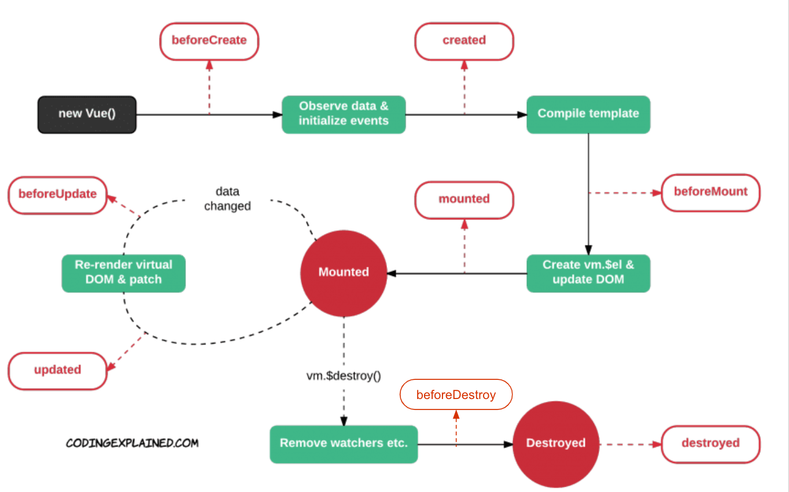
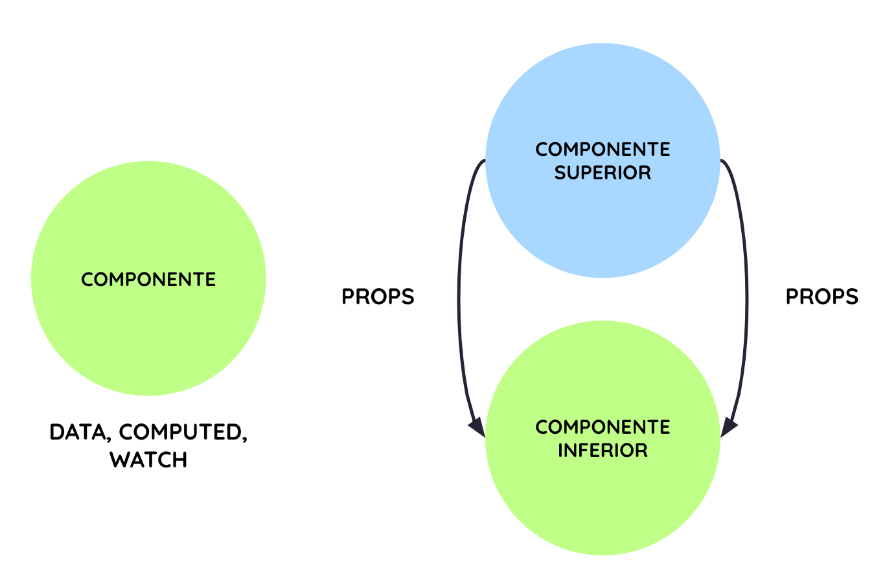
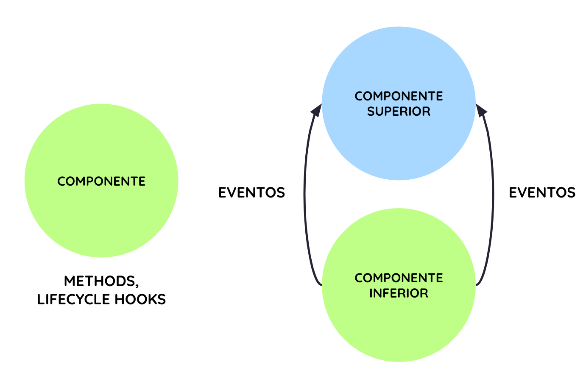
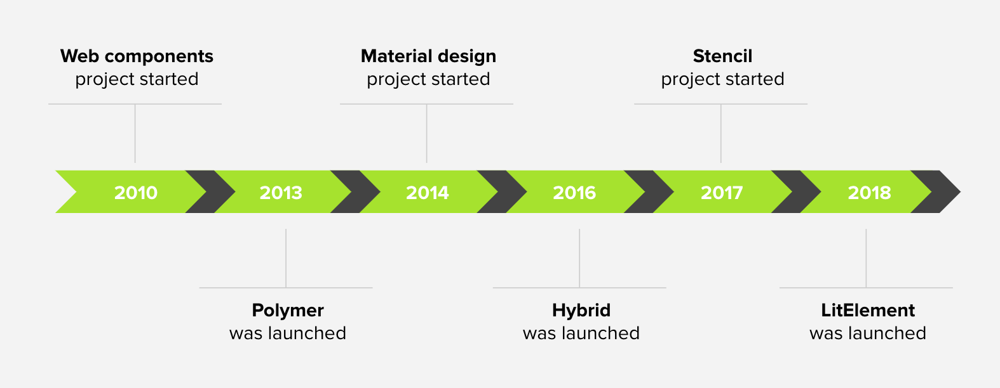
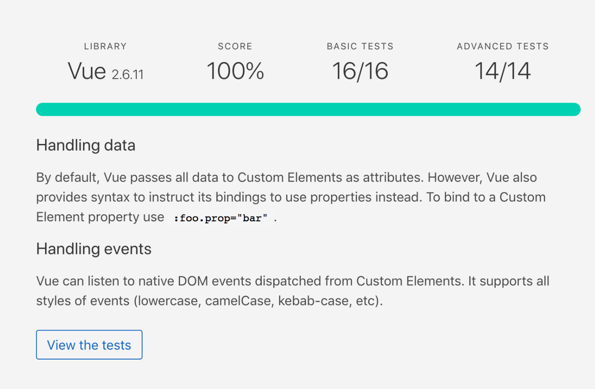

# Curso de Vue.js + Vuex

## CLASE 3

**Componentización**

* Métodos: Ciclo de vida (Hooks) y emisión de eventos
* Mixins
* Slots
* Web components

**Directivas**

* Directivas generales
* Directiva v-model
* Renderizado condicional
* Renderizado de listas

### NORMAS E INFORMACIÓN DE INTERÉS

* Puntualidad
* Líquidos y comida
* Descansos
* Cafetería


## Componentización 😱

Después de haber visto a nivel global qué es la componentización, hemos creado varios SFC (Single File Components), hemos visto los distintos tipos de componentes: Vista, Contenedores y Base. Hemos visto cómo gestionar los atributos propios del componente: Data, Computed, Watch. Cómo pasar información de componentes superiores a componentes inferiores a través de Props.

### Componentización - Métodos

Y hemos comenzado a ver cómo manipular los eventos propios del navegador para ejecutar nuestros métodos. Sólo nos queda conocer en detalle el ciclo de vida de un componente y cómo emitir eventos e información desde los componentes inferiores a los componentes superiores.

#### Métodos - Ciclo de vida

En primer lugar, debemos destacar que todos los componentes tiene un ciclo de vida. Esto quiere decir que tanto un componente de tipo vista como un componente base o contenedor siguen su propio ciclo de vida.

Este proceso esencialmente representa varios **estados**:

* Creación -> Montaje -> Actualización -> Destrucción

Estos estados son conocidos comúnmente como *hooks*.

Que nos van a permitir ejecutar lógica ligada al estado del componente.



En la anterior imagen podemos distinguir paso a paso el ciclo de vida de un componente.

Este ciclo de vida da comienzo cuando se crea la instancia del mismo dentro de Vue.
A continuación, se ejecuta el hook `beforeCreate()` que se ejecuta justo antes de que el modelo de datos de ese componente sea creado (data). Justo en el siguiente punto veremos como se ejecuta el hook `created()` donde se ha creado el modelo de datos, se han creado los observers sobre esa información y se han inicializado los eventos.

Justo después el template es compilado y llegamos al hook `beforeMount()`. Cuando el template es procesado e incluido en el DOM tendremos acceso al componente como tal, a `this.$el`, será porque hemos pasado por el hook `mounted()`.

A partir de este punto pueden pasar dos cosas. Por un lado, que el componente reciba alguna actualización de sus propiedades, lo que nos permitirá entrar en `beforeUpdate()` justo antes de que el cambio se refleje en el DOM. O cuando esté haya sido actualizado con el hook `updated()` y dicho cambio haya sido reflejado en el DOM. Por otro lado, puede que el componente sea eliminado del DOM por alguna razón, en este caso podemos distinguir dos hooks, `beforeDestroy()` justo antes de que sea eliminado del DOM o `destroyed()` cuando es eliminado y todos los watchers son eliminados.

Como puedes observar el ciclo de vida de un componente esencialmente está compuesto por cuatro estados:

* created
* mounted
* updated
* destroyed

Recordando estos cuatro estados serás capaz de prever los cuatro estados previos a estos que te permiten ejecutar lógica justo antes de que éstos se sucedan en el tiempo que vienen precedidos por la palabra **before**.

* beforeCreate / created
* beforeMount / mounted
* beforeUpdate / updated
* beforeDestroy / destroyed

Veamos en detalle cada uno de estos estados:

**created()**

- Registra observadores y eventos
- No se ha renderizado
- No se ha incluido en el DOM
- No podemos acceder a $el
- Nos permite ejecutar llamadas asíncronas

**mounted()**

- Se renderiza
- Se incluye el componente en el DOM
- Muy útil para inicializar librerías externas
- Uno de los más utilizados

**beforeUpdate()**

- Actualización de alguna propiedad
- Previo al re renderizado del Virtual DOM

**updated()**

- Se ha re renderizado los cambios en el DOM real.

**destroyed()**

- Elimina del DOM
- Destruye la instancia en memoria

```javascript
export default {
 name: 'MyComponent',
 created () {
   // ...
 },
 mounted () {
   // ...
 }
}
```

#### EJERCICIO
##### Métodos - Ciclo de vida

¡Conoce la **historia de cada casa** online!

- Recupera el ejercicio de la historia de cada casa
- Agrega un valor por defecto al dropdown: Gryffindor por ejemplo
- Tendrás que hacer una petición al inicializar el componente con ese valor por defecto
- Recuerda gestionar el loading en la primera carga

[Solución](https://codesandbox.io/s/history-house-hooks-6mbfr)

[Demo](https://6mbfr.csb.app/)


#### Métodos - Emisión de eventos

Como hemos visto hasta ahora un componente puede recibir información pero también puede emitir información. Para ello, contamos con la emisión de eventos que nos permite enviar información como payload y que pueden ser capturas por componentes superiores.

Desde un componente inferior podemos emitir un evento de la siguiente forma:

```javascript
<button type="button" @click="deleteWizard" />

methods : {
   deleteWizard () {
     this.$emit('delete-wizard')
   }
}
```

Así estamos emitiendo solamente el nombre del evento a capturar. Mientras que de la siguiente forma estamos emitiendo el nombre del evento a capturar y cierta información como payload.

```javascript
<button type="button" @click="deleteWizard" />

methods : {
   deleteWizard () {
     this.$emit('delete-wizard', this.wizard)
   }
}
```

Para capturar el evento en un componente superior, podríamos hacerlo de la siguiente forma:

```javascript
<my-component @delete-wizard="handleDelete" />

methods : {
   handleDelete (data) {
     // ...
   }
}
```

#### EJERCICIO
##### Métodos - Emisión de eventos

¡El **callejón Diagon** admite pedidos online!

- Recupera el ejercicio del callejón Diagon
- Crea un **componente** para cada fila DiagonItem.vue
- Envia a DiagonItem.vue como **prop** el item a renderizar
- **Emite los eventos** de incrementar y disminuir la cantidad
- Agrega un nuevo **botón** en cada fila que te permita eliminar un elemento del carrito emitiendo el index a eliminar

Tras finalizar el ejercicio echa un vistazo a las herramientas de desarrollo de Vue para ver la emisión de eventos y el payload que lleva cada emisión.

[Solución](https://codesandbox.io/s/vue-diagon-alley-emit-events-4bq3e)

[Demo](https://4bq3e.csb.app/)

LLegados a este punto, se podría decir que hemos dado toda la base para poder crear componentes dinámicos con Vue. Es por ello que resulta necesario dar un pequeño repaso a los conceptos clave de esta sección del curso.



En la anterior imagen podemos ver aquello que conforma la información local del componente: Data, Computed y Watch. 

Por una lado, tenemos **data**, que es el modelo de datos del componente y que es información local del mismo. Es aconsejable crearlo como función que retorna un objeto, puesto que, de esta forma este data quedaría anclada a este componente únicamente. Si lo creamos como objeto sería un objeto global que funcionaría como una variable global en javascript tendremos acceso a ella a través de todos los componentes. El problema de esto es que esta variable global puede ser modificada desde cualquier punto y si crece demasiado en el futuro nos de problema de inconsistencia de datos.

Las propiedades computadas o **computed**, son aquellas propiedades que escuchan una o varias propiedades y retornan un valor respecto a los valores que escuchan. El valor que retornan puede ser de cualquier tipo: String, Number, Boolean, Array, Objeto, etc. Su valor es inicializado al crearse el componente y es modificado dinámicamente cuando alguna de las propiedades de las que depende cambia su valor.

Los observadores o **watch**, son aquellas propiedades que escuchan a otra propiedad, aquella de la que reciben su nombre. Como parámetros reciben el nuevo y antiguo valor de dicha propiedad. Por defecto, no se ejecutan al inicializar el componente, a no ser que la definamos con la propiedad *inmediate*. Y nos permiten ejecutar lógica adicional.

Las **props** son aquella información que podemos enviar desde componentes superiores a componentes inferiores. Se pueden configurar de varias formas para proteger estos valores que vienen de fuera del componente. Por ejemplo: delimitando el tipo, un valor por defecto, definiendo si son requeridas o no e incluyendo una función de validación.



En esta imagen podemos diferenciar entre los distintos tipos de métodos que podemos ejecutar en un componente.

En primer lugar, nos encontramos con aquellos **métodos** propios del componente que creamos para ejecutar lógica. Estos métodos se ejecutan con los eventos propios del navegador: `click`, `input`, `focus`, etc. Y pueden incluir modificadores que van a modificar el comportamiento por defecto de dicho evento, como por ejemplo el modificador `prevent`.

Todos los componentes tienen un **ciclo de vida**, que esencialmente está compuesto por cuatro estados: creación, montaje, actualización y destrucción del componente. El primero de ellos supone la instanciación del componente, es decir, se crea el modelo de datos, se crean los watchers que van a observar cambios en ese modelo de datos y se inicializan los eventos. El segundo supone el compilado del template y la inclusión de dicho componente en el DOM. El tercero solo se da si hay un cambio en el modelo de datos del componente y en última instancia, la destrucción solo se da si en el algún momento el componente desaparece del DOM.

Por último, tenemos la posibilidad de **emitir eventos** desde componentes inferiores a componentes superiores. Lo que nos permite pasar información y capturar dichos métodos en el momento que se ejecutan.

#### PROYECTO
##### Proyecto Repaso

**Have you seen this wizard?**

- Crea un **listado** ficticio de magos que están en busca y captura
- Cada mago debe quedar reflejado en una tarjeta independiente **WizardCard.vue** con una imagen, nombre, precio…
- Esta tarjeta debe incluir también dos **botones** uno para **eliminar al mago** y otro para **cambiar el estado** de este a capturado

[Demo](https://pepem.csb.app/)

### Mixins

Los mixins esencialmente nos permiten **reutilizar funcionalidad entre componentes**.
Es muy diferente a cuando usamos una librería propia de helpers o utils. Puesto que éstas son librerías creadas con la extensión javascript nos exponen funciones que podemos reutilizar a lo largo de toda nuestra aplicación. Mientras que un mixin nos expone la funcionalidad propia de un componente y hace un merge entre dicha funcionalidad y la del componente en que estemos utilizando dicho mixin.

Veamos un ejemplo de mixin:

```javascript
// mixins/hello.js
export default {
 created() {
   this.hello()
 },
 methods: {
   hello() {
     console.log('hello from mixin!')
   }
 }
}
```

Para poder utilizar este mixin debemos hacer lo siguiente en el componente en el queremos utilizarlo:

```javascript
import hello from '@/mixins/hello

export default {
mixins: [hello]
}
```

#### Merge entre mixin y component

- Si tenemos la función `data()` definida en ambos con los mismos keys, tendrá prioridad lo que se ha definido en el componente.

- Muy útil si queremos contemplar ciertos valores por defecto.

Es decir, si tenemos en nuestro mixin definido:

```javascript
// MIXIN
data() {
   return {
    isPrivateRoute: true
   }
},
```

Y en nuestro componente hacemos uso de este mixin y tenemos la misma información definida de forma diferente, va a prevalecer la del componente porque es más específica.

```javascript
// COMPONENTE
data() {
   return {
    isPrivateRoute: false
   }
},
```

Si tenemos más información definida en nuestro componente lo que pasará es que la información del mixin sea agregada adicionalmente a la que venga definida en el componente previamente.

```javascript
// COMPONENTE
data() {
   return {
     userLogged: true,
     isPrivateRoute: true
   }
},
```

### Slots

Otra funcionalidad muy interesante de Vue son los `<slots>` que nos van a permitir crear huecos o espacios libres dentro de nuestros componentes.

Es muy útil para hacer theming de componentes desde fuera y es muy versátil ya que en estos huecos podremos incluir otros componentes o contenido dinámico.

Imagina un componente de navegación como puede ser este:

```javascript
// navigationLink.vue
<a
 v-bind:href="url"
 class="nav-link"
>
 <slot></slot>
</a>
```

Si dejamos un slot vacío, todo el contenido que definamos cuando utilicemos nuestro componente será incluido en ese hueco.

Que puede ser un único texto.

```html
// Usando componente
<navigation-link url="/profile">
    Your Profile
</navigation-link>
```

O varios elementos como puede ser un texto y un icono:

```html
// Usando componente
<navigation-link url="/profile">
    Your Profile
    <i class="material-icons">arrow_right_alt</i>
</navigation-link>
```

Otra cosa que podemos hacer con los slots es ponerle un nombre para que su contenido vaya en el lugar que queremos. Por ejemplo:

```html
// navigationLink.vue
<a
 v-bind:href="url"
 class="nav-link"
>
 <slot name="icon"></slot>
 <slot name="text"></slot>
</a>
```

```html
// Usando componente
<navigation-link url="/profile">
    <template v-slot="text">Your Profile</template>
    <template v-slot="icon">
        <i class="material-icons">arrow_right_alt</i>
    </template>
</navigation-link>
```

He creado un [ejemplo](https://codesandbox.io/s/vue-base-layout-z0hfp) de layout donde puedes ver un ejemplo más avanzado de cómo gestionar varios slots a más alto nivel.

### Web components

Hemos visto hasta ahora como crear componentes desde Vue, pero no nos imaginamos lo cerca que estamos del estándar si no le echamos un vistazo a los web components.

Los web components son esencialmente varias tecnologías web que se definieron para formar parte del estándar hace unos años. Estas tecnologías son:

- Custom elements
- Shadow DOM
- HTML Template
- JS Modules

Los **custom elements** nos permiten crear nuestros propios componentes, de la misma forma que creamos un `<app-button>` en Vue, y que el navegador sea capaz de entenderlo sin intermediarios. Los web components de los que ya hacemos uso son input, textarea, video, etc.

Estos elementos custom tienen su propio **shadow DOM**, que básicamente, lo que nos permite es abstraernos de su propio funcionamiento y estilo. Aunque en cierta medida nos permite controlarlo igual que hacemos ahora con los componentes que creamos en Vue, nos permiten pasarle información como atributos y nos permite capturar sus eventos con los addEventListerners que agregamos a dichos nodos y nos dan la información que estos eventos incluyen como payload.

Además, tenemos las etiquetas `<template>` que nos permite crear templates dinámicos, tal como estamos haciendo en los componentes con Vue.

Y por último, que esto es algo que ya estamos utilizando en nuestro día a día son las importaciones y exportaciones de **módulos de Javascript** que nos permite modularizar nuestro código y tenerlo separado en pequeñas piezas.

Si te das cuenta, todo lo que forma parte del estándar de los Web Components, en menor o mayor medida, ya lo estamos utilizando en nuestros componentes creados con Vue, lo que nos da un indicativo de que Vue está siguiendo el estándar. Además, lo que hemos comentado previamente de los slots, es algo que forma parte de los web components, dónde puedes ver más detalle [aquí](https://github.com/w3c/webcomponents/blob/gh-pages/proposals/Slots-Proposal.md).



En esta gráfica puedes ver cómo han ido evolucionando los componentes con el paso de los años. En ella puedes vemos que la primera definición del estándar de los web components se creó en 2010. Tres años después surgió Polymer que es una librería muy conocida para crear web components con ayuda de algunos polyfills, que nos permiten ser compatibles con los navegadores más modernos. Polymer es una librería que al igual que todas las que han surgido a posteriori (Hybrid, Stencil o LitElement) han impulsado el estándar de los web components y han permitido que a día de hoy el estándar sea compatible con los navegadores más modernos sin necesidad de usar a penas polyfills.



Podemos extraer desde [Custom Elements Everywhere](https://custom-elements-everywhere.com/) que Vue es 100% compatible con los Web Components.

Por un lado, porque envía toda la información que forma parte del modelo de datos como atributos a los custom elements y permite bindear esa información para que sea información dinámica.

Por otro lado, porque permite escuchar los eventos nativos desde los custom elements.

Para poder utilizar web components con Vue, puedes hacer uso de una librería que forma parte del ecosistema de Vue para poder crear un wrapper o contenedor de tus componentes web de la siguiente forma:

```javascript
import Vue from 'vue';
import wrap from '@vue/web-component-wrapper';
import MyWebComponent from './components/MyWebComponent';

const WrappedElement = wrap(Vue, MyWebComponent);
window.customElements.define('my-web-component', WrappedElement);
```

Para poder construir tus componentes puedes hacer uso del servicio de construcción de aplicaciones de vue de la siguiente forma:

```javascript
"scripts": {
 "build": "vue-cli-service build  --target wc --name my-web-component ./src/components/MyWebComponent.vue",
}
```

## Directivas 😱

A continuación, vamos a ver qué es una directiva dentro de Vue. Algunas ya te sonarán de haberlas utilizado en algún ejemplo anterior, pero es importante detenernos en cada una de ellas para saber qué nos ofrecen y poder utilizarlas adecuadamente.

### Directivas generales

Una directiva dentro de Vue, no deja de ser un atributo especial que se utiliza con el prefijo `v-`.
En su definición ya nos indican que son propias de vue. Con ellas podemos ejecutar acciones cuando el valor que están escuchando cambia.

#### v-html

Esta directiva nos permite interpretar HTML, que si no lo hiciéramos de esta forma quedaría sin interpretar en nuestro código y quedaría como un string.

```html
<div>{{ html }}</div>
<div v-html="html"></div>
```

```javascript
data() {
    return {
        html: '<p>HTML de prueba</p>',
    }
}
```

#### v-text

Esta directiva no cabe duda de que es una directiva que está prácticamente en desuso puesto que entre utilizar `v-text` o utilizar las llaves tenemos una clara preferencia. Pero es importante que sepas que existe y que nos permite de igual forma interpretar la información que viene en la propiedad que esté escuchando.

```html
<span>{{ msg }}</span>
<span v-text="msg"></span>
```

#### v-bind

Es una directiva que nos permite de una forma muy sencilla bindear en nuestro `<template>` un atributo de forma dinámica. De forma que si éste cambia el nodo se actualizará.

Veamos un ejemplo:

Si se trata de un atributo estático, que no va a cambiar no será necesario bindear nada, así que podemos utilizarlo de igual forma.

Pero si queremos bindearlo a una propiedad dinámica podemos hacer uso de `v-bind:` o `:` directamente. La primera es la versión larga, la segunda es la versión corta pero ambas hacen lo mismo. De hecho, lo más común es que te encuentres `:`, porque es algo que se repite muy a menudo.

```html
<button disabled="false">Button</button>
<button v-bind:disabled="isDisabled">Button</button>
<button :disabled="isDisabled">Button</button>
```

#### v-on

Es una directiva que nos permite ejecutar métodos de una forma muy sencilla. Podemos hacer uso de ella de dos formas, `v-on:` o `@`, ambos funcionan de igual forma, pero la segunda es la versión corta o shorthand. Vienen acompañadas del nombre del evento, posibles modificadores, como en el siguiente ejemplo (prevent) y el método a ejecutar.

```html
<button v-on:click.prevent="openModal"></button>
<button @click.prevent="openModal"></button>
```

### Directiva v-model

La directiva v-model es una directiva muy especial que nos permite hacer data-binding en los distintos tipos de campos (input, textarea, select, radio, checkbox) de una forma muy sencilla.

#### input

```html
<input v-model="filterText">
<p>{{ filterText }}</p>
```

El equivalente de usar `v-model` en un campo sería lo mismo que utilizar `value` y controlar el evento `input` para lanzar nuestro método de búsqueda.

```html
<input value="filterText" @input="filterSearch">
<p>{{ filterText }}</p>
```

#### textarea

```html
<textarea v-model="description"></textarea>
<p>{{ description }}</p>
```

Lo mismo sucede con los textarea. De igual forma, cuando estamos utilizando `v-model` realmente lo que está haciendo vue por nosotros es controlar el evento input y modificando su valor en value.

```html
<textarea value="description" @input="showField">
<p>{{ filterText }}</p>
```

Si en lugar de que se lance en el evento input, que es cada vez que el campo modifica su valor, queremos manipularlo con el evento change. Podemos agregar un modificador a v-model denominado `lazy`, que nos va a permitir cambiar el evento que se lanza.

```html
<input v-model.lazy="filterText">
<textarea v-model.lazy="description"></textarea>
```

Los modificadores que podemos agregar a un campo con `v-model` pueden concatenarse. Estos modificadores son:

* **lazy**: Que modifica su valor solo cuando se aplica el evento change, en lugar de input.
* **trim**: Que nos hace una limpieza del valor que estamos guardando.
* **number**: Que nos obliga a que el valor sea numérico.

```html
<input v-model.lazy.trim="filterText">
<input v-model.trim="filterText">
<input v-model.number="filterText">
```

#### checkbox

```html
<input v-model="vehicle" type="checkbox" />
<p>{{ vehicle }}</p>
```

```html
<input checked @change="setVehicle" type="checkbox" />
<p>{{ vehicle }}</p>
```

#### radio

```html
<input v-model="gender" type="radio" />
<p>{{ gender }}</p>
```

```html
<input checked @change="setGender" type="radio" />
<p>{{ gender }}</p>
```

#### PROYECTO
##### Proyecto Repaso

**Have you seen this wizard?**

- Vamos a recuperar el proyecto y agregar un **header**
- En el header agregaremos un **título a la página**
- Y un **input** que nos permitirá filtrar por nombre los magos

[Demo](https://pepem.csb.app/)

### Renderizado condicional

Hay una serie de directivas que nos van a permitir mostrar o no un nodo dependiendo de la comprobación que estemos haciendo.

* v-if / v-else-if / v-else
* v-show

Por ejemplo, podemos manejar el estado cargando de nuestra página y en base a eso mostrar un loader o el contenido de la página.

```html
<div v-if="loading">
    <app-loader />
</div>

<div v-else>
    <p>The content will be here!</p>
</div>
```

#### v-if / v-else-if / v-else

Tenemos que tener en cuenta que si hacemos uso de esta directiva y tenemos un gran número de elementos en este sentido el renderizado condicional es más lento. Puesto que estamos creando y eliminando nodos del DOM real.

Esta directiva crea o destruye el nodo si se cumple o no la condición que está comprobando. Y de igual forma crea o elimina los event listeners generados.

Su uso es recomendable para algo que puede cambiar una vez o muy poco.

#### v-show

Tenemos que tener en cuenta que si hacemos uso de esta directiva y tenemos un gran número de elementos la carga inicial será más lenta puesto que está creando los nodo siempre.

Solo les aplica CSS si la condición se da o no, de forma que aplica display block o none, en función de la condición.

Su uso es recomendable para nodos que puedan pintarse o no repetidamente.

#### PROYECTO
##### Proyecto Repaso

**Have you seen this wizard?**

- Vamos a recuperar el proyecto
- Gestiona la búsqueda:

    - **Si hay resultados** al filtrar se mostrará el listado filtrado.
    - **Si no hay resultados** se mostrará un mensaje al usuario para que intente una nueva búsqueda

[Demo](https://pepem.csb.app/)

### Renderizado de listas

Para poder gestionar listas, podemos hacer uso de una directiva que nos permite iterar sobre una colección de elementos. Que crea un template dinámico por cada iteración.

Para ello, haremos uso de la directiva `v-for` y el atributo `key`.

Primero creamos una colección de elementos:

```javascript
data() {
    return {
        links: [
        { id: 0, title: 'Home' },
        { id: 1, title: 'About' },
        { id: 2, title: 'Contact' }
        ]
    }
}
```

Después iteramos sobre ella:

```html
<ul>
    <li v-for="(link, index) in links">
        {{ index }} - {{ link.title }}
    </li>
</ul>
```

El atributo key es obligatorio incluirlo y debe ser único por cada colección.
Porque nos permite darle identidad a un nodo. Y no permite controlar la reactividad adecuadamente. De forma que si algún dato de la colección inicial cambia, solo repintará los elementos que hayan cambiado. No toda la colección.

```html
<ul>
    <li v-for="link in links" :key="link.id">
    {{ link.title }}
    </li>
</ul>
```

#### PROYECTO
##### Proyecto Repaso

**Have you seen this wizard?**

- Vamos a recuperar el proyecto
- Gestiona el listado de magos con v-for y key

[Demo](https://pepem.csb.app/)

### RECURSOS

- [Lifecycle Component](https://alligator.io/vuejs/component-lifecycle/)
- [Emisión de eventos custom](https://medium.com/javascript-in-plain-english/emitting-custom-events-vuejs-tutorial-2689390df096)
- [Slots en componentes](https://alligator.io/vuejs/component-slots/)
- [Vue relation to custom elements](https://vuejs.org/v2/guide/#Relation-to-Custom-Elements)
- [Custom elements everywhere](https://custom-elements-everywhere.com/)
- [Propuesta slot estándar](https://github.com/w3c/webcomponents/blob/gh-pages/proposals/Slots-Proposal.md)
- [Charla Web Components](https://www.youtube.com/watch?v=y9RX6UjNQE4&t=3s)
- [Vue + Web components](https://github.com/snirp/vue-web-component)
- [Vue + Web components](https://medium.com/@royprins/get-started-with-vue-web-components-593b3d5b3200)
