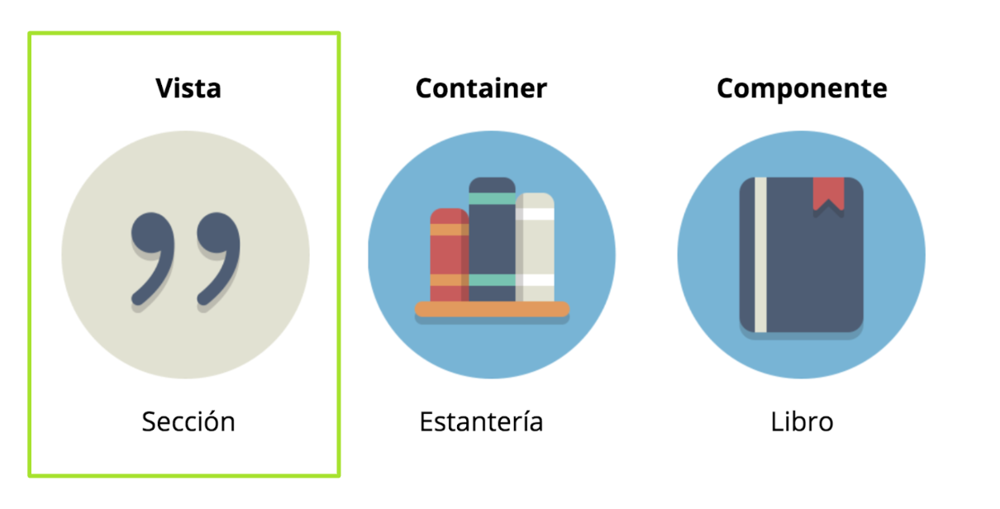
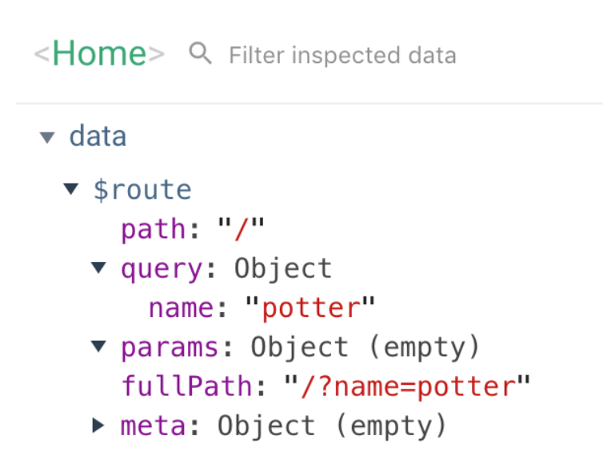
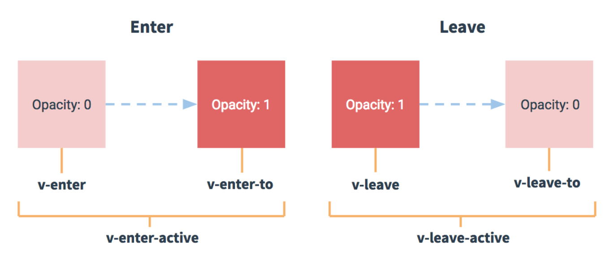

# Curso de Vue.js + Vuex

## CLASE 4

**Styling**

* Configuración de preprocesadores
* Scoped vs general
* Ecosistema de dependencias

**Vue Router**

* vue-router
* Enrutado de aplicación básico
* Definición de rutas
* Configuración router-link
* Gestión de información entre rutas
* Segmentos dinámicos
* Página no encontrada
* Rutas anidadas
* Navegación programática
* Navigation Guards
* Transitions
* Lazy loading

### NORMAS E INFORMACIÓN DE INTERÉS

* Puntualidad
* Líquidos y comida
* Descansos
* Cafetería

## Styling 😱

Vue tiene una integración muy buena con CSS nativo y nos permite escribir nuestros estilos según nuestras necesidades. De forma, que podemos escribir CSS de la forma en que más cómodos nos sintamos.

Gracias a los `vue-loader`, podemos hacer uso de los preprocesadores y/o postprocesadores. Que se encargan de compilar nuestro CSS para que sea entendido y lo más compatible posible con los navegadores a los que queremos dar soporte.

De esta forma podemos escribir también CSS con otras tecnologías como: SASS, LESS y Stylus. Y con ayuda de tecnologías como PostCSS no perdemos compatibilidad.

Para poder hacer uso de estas tecnologías deberemos instalar los loader en cuestión. Por ejemplo para instalar sass o postcss debemos hacer lo siguiente:

### Configuración de preprocesadores

```javascript
npm install -D sass-loader node-sass
npm install -D postcss-loader
```

Una vez instaladas las dependencias para hacer que nuestro CSS sea preprocesado debemos incluir el atributo `lang` en las etiquetas style de nuestros componentes, de la siguiente manera:

```html
<style lang="scss"></style>
<style lang="stylus"></style>
<style lang="less"></style>
```

Así podremos hacer uso de todo lo que un preprocesador nos aporta, véase en el ejemplo a continuación: mixins, variables y herencia de clases.

```html
<style lang="scss">
.button {
  @include align-center-inside();
  font-family: $font-circular-book;

  &--small {
    width: 88px;
  }
}
</style>
```

### Scoped vs general

Vue nos ofrece de una forma muy sencilla poder limitar el CSS de nuestro a componente a dicho de componente, de forma que si utilizamos estilos genéricos, éstos no afectarán de forma genérica a dichos estilos, sólo a aquello que hayamos definido en nuestro componente.

Esta forma se denomina `scoped`. Para poder hacer uso de este tipo de estilos bastará con agregar el atributo scoped a la etiqueta `<style>`:

```css
<style scoped>
.red {
 color: red;
}
</style>
```

Luego podremos hacer uso de esta clase de la misma manera que lo haríamos sin el atributo scoped.

```html
<template>
  <p class="red">
    This should be red
  </p>
</template>
```

Por debajo Vue lo que está haciendo por nosotros es agregarle un **atributo único** a los elementos que tienen el estilo `scoped`, aquí puedes ver un ejemplo:

```css
.list-container:hover 
.list-container[data-v-21e5b78]:hover
```

### CSS Modules

Los módulos de CSS funcionan de forma similar a los estilos `scoped`, puesto que lo que hacen es limitar el CSS a nuestro componente. La única diferencia con el anterior es que en lugar de crear atributos únicos a nuestros elementos, lo que hacen es crear **clases únicas**, como puedes ver en el siguiente ejemplo:

```css
red
red_1VyoJ-uZ
```

Para poder hacer uso de los CSS modules, bastará con agregar el atributo `module` a nuestras etiquetas style.

```css
<style module>
.red {
 color: red;
}
</style>
```

Por otro lado para utilizar dicho módulo de CSS tendremos que acceder al objeto `$style` que tendrá como atributo todas nuestras clases.

```html
<template>
  <p :class="$style.red">
    This should be red
  </p>
</template>
```

### Clases y estilos

Como puedes observar Vue es muy flexible en cuanto a la forma de gestionar el CSS, nos permite trabajar los estilos de nuestros componentes de la forma en que más cómodos nos sintamos.

Además de todo esto nos permite poder aplicar clases y estilos a nuestros componentes en base a cierta lógica de una forma muy sencilla.

```html
<!-- one word class -->
<div :class="{ active: isActive }"></div>
<!-- two words class -->
<div :class="{ 'text-danger': hasError }"></div>
<!-- ternary class -->
<div :class="[ isActive ? activeClass : '' ]"></div>
```

```html
<!-- one word style -->
<div :style="{ color: activeColor }"></div>

<!-- two words style -->
<div :style="{ 'font-size': fontSize + 'px' }"></div>
```


#### PROYECTO
##### Styling

Have you seen this wizard?

- Recupera el proyecto de la búsqueda y captura de magos
- Crea un formulario que te permita crear nuevos magos: nombre, precio e imagen.
- Modifica el CSS de cada campo en base a una validación mínima. Por ejemplo: que los tres campos tengan información y que mínimo tengan 3 caracteres.

[Solución](https://codesandbox.io/s/have-you-seen-this-wizard-pepem)
[Demo](https://pepem.csb.app/)


## Vue Router

Hasta ahora hemos trabajado con **componentes base** y **componentes contenedores**.
Dejando de lado los **componentes vista**, que nos van a permitir crear componentes que se van a encargar de gestionar la aplicación dividida por rutas.



### vue-router

Es la librería oficial de routing de Vue, por su integración completa con esta tecnología.
Los [contribuidores](https://github.com/vuejs/vue-router/graphs/contributors) principales de esta tecnología son: [Evan You](https://twitter.com/youyuxi) y [Eduardo San Martín](https://twitter.com/posva).

Esta librería esencialmente nos brinda la posibilidad de:

- Gestionar vistas
- Crear rutas anidadas
- Configuración de las rutas basadas en componentes vista
- Nos va a permitir pasar parámetros o query params entre rutas
- Crear un sistema de transiciones de rutas sencillo
- CSS en los links
- Modo HTML5 history
- Personalizar comportamiento del scroll

### Enrutado de aplicación básico

Para comenzar a desarrollar un enrutado básico de nuestra aplicación puede que nos encontremos en una de estas situaciones:

- **Proyecto nuevo**. Al crear el proyecto con el CLI de Vue podremos agregar **vue-router** como dependencia en la configuración manual del proyecto, siguiendo los siguientes pasos.

```javascript
? Check the features needed for your project: Babel, Router, Linter
? Use history mode for router? Yes
```

- **Proyecto iniciado**. Puede que tengamos un proyecto que inicialmente no estaba pensado para tener gestión de rutas dinámicas y ahora lo necesitemos. Los pasos a seguir son muy sencillos:

1. **Instalación** librería en proyecto:

```
npm install vue-router --save
```

2. Crea una carpeta denomina `/router` dentro de la carpeta `/src` que incluya un fichero denominado: `index.js` donde vamos a incluir la **configuración** de nuestro router.

- En este fichero vamos importar vue y vue-router.
- Después le diremos a Vue que lo utilice como dependencia con Vue.use()
- Exportamos nuestro router que es una instancia de vue-router

```javascript
// router/index.js

import Vue from 'vue'
import VueRouter from 'vue-router'

Vue.use(VueRouter)

export default new VueRouter({});
```

3. En nuestro fichero de javascript principal de la aplicación `main.js`. Deberemos importar el router y hacer uso del mismo en la instancia de Vue.

```javascript
// main.js
import Vue from 'vue'
import router from './router';
import App from './App.vue'

Vue.config.productionTip = false

new Vue({
  router,
  render: h => h(App),
}).$mount('#app')
```

4. Ya podemos empezar a configurar nuestro router en base a los componentes vista que hayamos creado.

```javascript
// router/index.js
import Vue from 'vue'
import VueRouter from 'vue-router'

// View Components imports
import Home from '@/views/Home.vue';
import About from '@/views/About.vue';

Vue.use(VueRouter)

// Configuration of router with this components
export default new VueRouter({
    routes: [
        { path: '/', component: Home },
        { path: '/about', component: About }
    ]
});
```

5. Para que el router funcione necesitaremos agregar el elemento `<router-view />` en nuestro componente principal: `App.vue`.

> <router-view> Es el encargado de cargar dinámicamente el componente que le hayamos dicho en la configuración que debe cargar en base a la ruta en la que queremos acceder.

6. Para poder acceder a las distintas rutas podríamos crearnos un menú y hacer uso del componente `<router-link>` por cada una de ellas.

- Componente **TheHeader.vue** y agrega un título y un menú.
- Componente **TheFooter.vue** con información estática.
- Incluye en **App.vue** ambos componentes y deja el componente `<router-view />` entre estos componentes
- Comprobar renderizado de componentes (*) Paint flashing 

```html
<router-link to="/">Home</router-link>
<router-link to="/about">About</router-link>
```

* [Ejemplo Router como librería](https://jsfiddle.net/yyx990803/xgrjzsup/)
* [Ejemplo Router como framework](https://codesandbox.io/s/vue-with-simple-routing-uhlwf)

#### EJERCICIO
##### Enrutado de aplicación básico

**Wizards Characters**

- Crea una nueva aplicación Wizards Characters 
- Componente TheHeader.vue con un título
- Componente TheFooter.vue con información estática
- Crea dos componentes vista: Home y About
- Agrega un menú en el header que te permita navegar entre estas vistas

```html
<router-view />
<router-link to="/">Home</router-link>
```

[Solución](https://codesandbox.io/s/vue-with-simple-routing-uhlwf)

[Demo](https://uhlwf.csb.app/#/)

#### Definición de rutas:

Cuando definimos nuestras rutas podemos crearlas con un **path, name y el componente** que queremos que se renderice en esa ruta.

```javascript
const router = new VueRouter({
  routes: [
    {
      path: '/wizard/:id',
      name: 'wizard',
      component: Wizard
    }
  ]
})
```

También podemos definir nuestras rutas de forma que podamos ver en una ruta diferentes **componentes**. Muy útil cuando estamos componentizando también a nivel de layout.

```javascript
const router = new VueRouter({
  routes: [
    {
      path: '/',
      name: 'home',
      components: {
        default: Slider,
        main: Main,
        sidebar: Sidebar
      }
    }
  ]
})
```

```html
<router-view class="view slider"></router-view>
<router-view class="view main" name="main"></router-view>
<router-view class="view sidebar" name="sidebar"></router-view>
```

Desde la definición de rutas, también podemos hacer **redirecciones** de una forma muy sencilla:

```javascript
const router = new VueRouter({
  routes: [
    { path: '/my-whitelist', redirect: '/white-list' },
    { path: '/my-whitelist', redirect: { name: 'whitelist' }}
  ]
})
```

Además, podemos agregar información **meta** a las rutas, como información complementaria de la ruta.

```javascript
const router = new VueRouter({
  routes: [
    { path: '/my-whitelist', meta: { requiresAuth: true } },
  ]
})
```

Para recuperar esta información y poder redireccionar al login en caso de que el usuario no haya iniciado sesión podremos gestionarlo de la siguiente forma:

```javascript
router.beforeEach((to, from, next) => {
  if (to.matched.some(record => record.meta.requiresAuth)) {
    if (!auth.loggedIn()) {
      next({
        path: '/login',
        query: { redirect: to.fullPath }
      })
    } else {
      next()
    }
  } else {
    next()
  }
})
```

#### Configuración router-link

El componente `<router-link>` sirve de enlace para navegar entre rutas y nos permite configurarlo a través de las ya conocidas **props**.

```html
<router-link to="/" replace>Home</router-link>
```

Estas son las que nos permiten controlarlo:

* **to** - Ruta destino
* **replace** - Se aplica el método router.replace() en lugar de router.push()
* **append** - Anidación de rutas dinámicas
* **tag** - Etiqueta a utilizar (*) Accesibilidad
* **active-class** - Por defecto: `router-link-active`
* **exact** - Ruta concreta
* **event** - Por defecto: click

### Gestión de información entre rutas

Con vue-router tenemos varias formas gestionar información entre rutas:

#### Segmentos dinámicos

- Crear un nuevo segmento en nuestra aplicación
- Este segmento además va a ser dinámico
- Nos va a permitir reutilizar nuestros componentes

Veamos los segmentos dinámicos con un ejemplo muy sencillo:

```javascript
// router/index.js
export default new VueRouter({
    routes: [
        { path: '/', component: Home },
        { path: '/about', component: About },
        { path: '/wizard/:id', component: Wizard }
    ]
});
```

Como puedes observar en el ejemplo, nos permite pasar una propiedad dinámica a través de la información de la ruta. De esta forma estamos reutilizando el componente vista **Wizard** para todas las subrutas de wizard.


En el componente podemos recuperar el valor que nos viene dado en la ruta como parámetro, dentro del objeto `$route`.

```html
<!-- Wizard.vue -->
<p>Wizard {{ $route.params.id }}</p>
```

A la hora de crear el enlace que me va a llevar al detalle de este mago, la ruta se podría crear dinámicamente con ayuda de `router-link`.

```html
<!-- TheHeader.vue -->
<router-link class="the-header__link" to="/wizard/5">Wizard</router-link>
<router-link class="the-header__link" :to="`/wizard/${wizard.id}`">Wizard</router-link>
```

[Ejemplo](https://codesandbox.io/s/vue-with-dynamic-segment-0jc3e)

Otra forma de recibir la información entre rutas, puede ser como una **prop**, de forma que el componente vista va a recibir esa información como una prop más. Y no necesitamos acceder a la información de la ruta con `$route`.

Veamos un ejemplo:

```javascript
const router = new VueRouter({
  routes: [
    {
      path: '/wizard/:id',
      component: Wizard,
      props: true
    },
  ] 
})
```

```html
<!-- Wizard.vue -->
<!-- Before -->
<p>Wizard {{ $route.params.id }}</p>
<!-- After -->
<p>Wizard {{ id }}</p>
```

#### EJERCICIO
##### Segmentos dinámicos

Wizard Characters

- Recupera la aplicación Wizards Characters 
- Utiliza el endpoint /characters de potterapi.com o http://hp-api.herokuapp.com/api/characters
- Recupera en la home el listado de todos los magos con un componente que reutilices WizardCard
- El componente debe tener un enlace a una página detalle de ese mago con una propiedad dinámica que te permita recuperar el mago al entrar al detalle

[Demo](https://6mbfr.csb.app/)

```javascript
fetch('https://www.potterapi.com/v1/characters?key=APY_KEY')
.then((response) => response.json())
.then((characters) => console.log(characters));
```

Si lo prefieres puedes utilizar este [mock](https://codesandbox.io/s/wizards-whr6y)


#### QueryParams

Previamente hemos visto cómo acceder a los parámetros que vienen dados en la ruta, pero también podemos acceder a los queryParams que normalmente vienen relacionados con una búsqueda en la aplicación por parte del usuario y se ven en la ruta de la siguiente forma: `/?name=potter`.



Para poder recuperarlos en un componente vista bastará con acceder a la información de la ruta actual de la siguiente forma:

```javascript
$route.query.name
```

En caso de querer modificarlos podremos utilizar los métodos propios del router para modificar los queryParams de esta ruta:

```javascript
$router.push({ query: { name: 'potter' }})
```

A través de la configuración de rutas, también podemos interceptar los queryParams para modificarlos al modelo de datos que espera la vista y que ésta los reciba como props. 

Muy útil para desacoplar la lógica del proyecto del SEO definido para el proyecto.

Veamos un ejemplo:

```javascript
const router = new VueRouter({
  routes: [
    { path: '/', component: Home, props: (route) => ({ search: route.query.s }) }
  ]
})
```

Si el usuario aplica una búsqueda en la URL lo veremos así: `/?s=potter`
Y nuestro componente Home recibirá como prop: `{search: 'potter'}`

#### EJERCICIO
##### QueryParams

**Wizards Characters**

- Recupera la aplicación Wizards Characters 
- Crea un campo de texto que te permita filtrar los personajes por nombre cuando el usuario haga clic en un botón auxiliar y/o cuando pulse la tecla enter
- Cuando la búsqueda se ejecute guarda en la URL la búsqueda como queryParams
- BONUS: 
  - Si recargas la página y hay queryParams tendrás que guardar la búsqueda
  - Gestionar resultados filtrados, de forma que si no hay resultados aparezca un mensaje al usuario

#### Página no encontrada

Si queremos gestionar que alguien está intentando entrar a una ruta no controlada podemos poner en la configuración de nuestro router el `path: '*'` y renderizar el componente de Página no encontrada.

```javascript
// router/index.js
export default new VueRouter({
    routes: [
        // The last one
        { path: '*', component: PageNotFound }
    ]
});
```

[Ejemplo](https://codesandbox.io/s/vue-with-page-not-found-8bwrs)


#### EJERCICIO
##### Página no encontrada

Wizards Characters

- Recupera la aplicación Wizards Characters 
- Agrega la configuración y el componente PageNotFound en tu aplicación para controlar los accesos a una ruta no controlada

### Rutas anidadas

En varias ocasiones vamos a precisar de hacer uso de las rutas anidadas, que no dejan de ser subrutas.

Por ejemplo: queremos acceder a la sección de `/settings` de nuestra aplicación y esta sección tiene como subrutas: `/settings/profile` `/settings/notifications`.

Para poder construir este tipo de rutas en nuestra aplicación debemos configurar nuestro routing de la siguiente manera:

```javascript
export default new VueRouter({
    routes: [
        { 
            path: '/settings',
            component: Settings,
            children: [
                {
                    path: 'profile',
                    component: SettingsProfile
                },
                {
                    path: 'notifications',
                    component: SettingsNotifications
                }
            ]
        },
        { path: '*', component: PageNotFound }
    ]
});
```

Hacemos uso del nodo `children` para poder crear las subrutas. Pero para hacerlo funcionar precisamos que en nuestro componente `Settings.vue` tengamos un `<router-view/>` definido que es donde nuestros componentes se van a renderizar.

```html
<template>
    <div>
        <h2>Settings</h2>
        <router-link class="app__link" to="/settings/profile">Profile</router-link>
        <router-link class="app__link" to="/settings/notifications">Notifications</router-link>
        <router-view />
    </div>
</template>
```

Así podremos navegar entre nuestros componentes y si inspeccionamos con las herramientas de renderizado nuestra página veremos todo su potencial en marcha.

[Ejemplo](https://codesandbox.io/s/vue-with-nested-routes-nfdkk)

#### EJERCICIO
##### Rutas anidadas

Wizards Characters

- Recupera la aplicación Wizards Characters 
- Crea una sección de tu aplicación que te permita tener rutas anidadas
- Por ejemplo: universo harry potter, libros, peliculas...

### Navegación programática

Hasta ahora hemos visto la forma más declarativa que nos permite Vue de gestionar las rutas en nuestras aplicaciones. Que esencialmente se resume en configurar el router en nuestro fichero de configuración `router/index.js`, crear los componentes vista necesarios para esas rutas y permitir el acceso a esas rutas o subrutas gracias a `<router-view>` y `<router-link>`.

Pero dentro de nuestros componentes también podemos gestionar las rutas de forma programática y es realmente sencillo si se entienden los conceptos clave.

`this.$router` Equivale a la instancia de nuestro router. [Documentación](https://router.vuejs.org/api/#router-instance-methods)

`this.$route` Equivale a la ruta en la que estamos. [Documentación](https://router.vuejs.org/api/#the-route-object)

#### router.push()

Con `router.push()` estamos navegando de forma programática a otra ruta a partir de cierta lógica en nuestra aplicación.

Imaginemos un sencillo sistema de autorización. Si el usuario no está autenticado y está intentando acceder a una ruta privada, lo que podemos hacer previamente es comprobar su sesión y si no está activa le redirigiremos a la página de login.

```javascript
router.push(location, onComplete?, onAbort?)
```

```javascript
// literal string path
router.push('/')

// object
router.push({ path: '/' })

// path with paramas
router.push({ path: `/wizard/${wizardId}` })

// named route
router.push({ name: 'wizard', params: { wizardId } })

// with query, resulting in /register?search=potter
router.push({ path: '/', query: { search: 'potter' } })
```

El equivalente de forma declarativa a este método sería la utilización de la etiqueta `<router-link>` con el atributo `to` definido.


| Declarativa                         | Programática                        |
| ----------------------------------- | ----------------------------------- |
| `<router-link :to="...">`           | `router.push(...)`                  |


¡IMPORTANTE! Con este método estamos manteniendo el histórico de nuestro navegador y estamos agregando esta nueva navegación. De forma que si el usuario intenta volver atrás, a la ruta anterior, vamos a tener acceso a esta navegación en el histórico de navegaciones.

#### router.replace()

Con `router.replace()` igual que sucede con el método `router.push()`, estamos navegando de forma programática a otra ruta en base a la lógica de nuestra aplicación.

La diferencia entre `push` y `replace` es que el primero se guarda en el histórico de navegaciones. El segundo solo reemplaza la ruta en la que estamos y NO la agrega al histórico.

```javascript
router.replace(location, onComplete?, onAbort?)
```

```javascript
// literal string path
router.replace('/')

// object
router.replace({ path: '/' })

// path with paramas
router.replace({ path: `/wizard/${wizardId}` })

// named route
router.replace({ name: 'wizard', params: { wizardId } })

// with query, resulting in /register?search=potter
router.replace({ path: '/', query: { search: 'potter' } })
```

| Declarativa                         | Programática                        |
| ----------------------------------- | ----------------------------------- |
| `<router-link :to="..." replace>`   | `router.replace(...)`               |


#### router.go(n)

Con este método podemos navegar hacia delante o detrás entre el histórico del navegador tantas veces como le hayamos indicado por parámetro.

Funciona de igual forma que: `window.history.go(n)`

```javascript
router.go(1)
router.go(-1)
```

### Navigation Guards

Una **navigation guard** nos va a permitir proteger todas las navegaciones en nuestra aplicación.
Nos va a permitir redireccionar o cancelar la navegación.
Se pueden crear de tres formas: globalmente, por ruta o por componente.
Funciona de forma muy similar a los hooks de los componentes.

#### Global: router.beforeEach()

Esta guarda se va a ejecutar cada vez que se lance una nueva navegación.
De forma que nos permite interceptar todas las navegaciones antes de que se completen.

Podemos ver un ejemplo muy recurrente, que es cuando tenemos un sistema de rutas públicas y privadas. Pues podemos hacer esta comprobación a nivel global interceptando todos los accesos.

```javascript
router.beforeEach((to, from, next) => {
  if (!isAuthenticated) next('/login')
  else next()
})
```

`next()` : Se mueve al siguiente hook y confirma la navegación.
`next(false)` : Nos permite abortar la navegación.
`next('/')` o `next({ path: '/' })` : Aborta la navegación previa y redirige a otra navegación.
`next(error)`: Aborta la navegación y genera un error.

(*) Tras ejecutar el hook siempre hay que utilizar next(), si no, la navegación quedará bloqueada.

#### Global: router.beforeResolve()

Se ejecuta justo antes de se confirme la navegación.
Se ejecuta después de que se resuelvan todas las guardas en los componentes.

```javascript
router.beforeResolve((to, from, next) => {
  // ...
})
```

#### Global: router.afterEach()

Esta guarda se ejecuta cuando la navegación a una ruta se ha completado.
De hecho, no afecta a la navegación pero nos permite ejecutar lógica a posteriori de que la ruta haya sido cargada.

```javascript
router.afterEach((to, from) => {
  // ...
})
```

#### Ruta: beforeEnter()

Este tipo de guarda se define en la configuración de la ruta en la que queremos hacer comprobaciones previas a la navegación.

Es similar a `beforeEach()` solo que éste se ejecuta para todas las rutas y `beforeEnter()` solo en las rutas que lo hayamos configurado.

```javascript
const router = new VueRouter({
  routes: [
    {
      path: '/',
      component: Home,
      beforeEnter: (to, from, next) => {
        // ...
      }
    }
  ]
})
```

#### Componentes: beforeRouteEnter / beforeRouteUpdate / beforeRouteLeave

En los componentes de tipo vista podemos hacer uso de tres guardas específicas que nos van a permitir controlar la navegación a dicha ruta.

**beforeRouteEnter()**

- Se ejecuta antes de que el componente se renderize
- No tenemos acceso a `this` como componente

```javascript
beforeRouteEnter (to, from, next) {
    //...
},
```

**beforeRouteUpdate()**

- Se ejecuta cuando la ruta es modificada y se reutiliza el componente.
- Por ejemplo, por modificación de parámetros en la ruta
- Tenemos acceso a `this`

```javascript
beforeRouteUpdate (to, from, next) {
    // ...
},
```

**beforeRouteLeave()**

- Se ejecuta justo antes de que abandonemos la ruta
- Nos permite acceder a `this`
- Podemos cancelar la navegación `next(false)`
- Muy útil si el usuario se marcha sin confirmar los cambios.

```javascript
beforeRouteLeave (to, from, next) {
    // ...
}
```

#### EJERCICIO
##### Navigation guards

**Wizards Characters** 

- Recupera la aplicación Wizards Characters 
- Crea una sección de tu aplicación que te permita tener controlado el login de tus usuarios
- Para ello puedes controlar con router.beforeEach() a nivel global el acceso a tus rutas
- Crea una página de login y guarda la sesión del usuario cada vez que complete el formulario de login
- Redirige al usuario cuando complete su login a la home

El flujo de las navegaciones:

- Se lanza ejecución de navegación.
- `beforeRouteLeave()` en componentes
- `beforeEach()` a nivel global
- `beforeRouteUpdate()` en componentes
- `beforeEnter()` en la configuración de rutas
- Componentes asíncronos
- `beforeRouteEnter()` en componentes
- `beforeResolve()` a nivel global
- Se confirma la navegación
- `afterEach()` a nivel global
- Se actualiza el DOM
- `beforeRouteEnter()` callback

### Transitions

El elemento `<transition>` permite aplicar efectos de transiciones.

Cuando un elemento es: insertado, actualizado o eliminado del DOM.

Muy útil cuando estamos utilizando:

- Renderizado condicional (v-if / v-show)
- Componentes dinámicos
- Cuando solo hay un nodo root en el componente

- Podemos aplicarlo a nivel general para todos los `<router-view>`

```html
<transition>
    <router-view></router-view>
</transition>
```

- Podemos aplicarlo dentro del componente para aplicarle un estilo específico.

```html
<transition name="fade">
    <div>...</div>
</transition>
```

```html
<transition name="slide">
    <div>...</div>
</transition>
```

```css
// fade
.fade-enter-active,
.fade-leave-active {
  transition: opacity .5s;
}
.fade-enter, .fade-leave-to {
  opacity: 0;
}
```
```css
// slide
.slide-fade-enter-active {
  transition: all .3s ease;
}
.slide-fade-leave-active {
  transition: all .8s cubic-bezier(1.0, 0.5, 0.8, 1.0);
}
.slide-fade-enter,
.slide-fade-leave-to {
  transform: translateX(10px);
  opacity: 0;
}
```

#### Estados de transiciones



* **v-enter**: Comienza la transición de entrada. Justo antes de que el elemento en cuestión sea insertado o eliminado.

* **v-enter-to**: Comienza cuando finaliza el estado de entrada. Se agrega un frame después de que el elemento haya sido insertado o eliminado.

* **v-enter-active**: Se da mientras el estado de entrada está activo. Se agrega antes de que el elemento sea insertado o eliminado y se elimina cuando la transición ha finalizado. Se suele utilizar para definir la duración y efecto de la transición.

* **v-leave**: Comienza cuando el estado de salida se lanza. Se agrega inmediatamente cuando una transición de salida es lanzada.

* **v-leave-to**: Comienza cuando el estado de salida finaliza. Se agrega un frame después de que la transición haya finalizado.

* **v-leave-active**: Se da mientras el estado de salida está activo. Se agrega antes de que la transición de salida sea lanzada y se elimina cuando la animación ha finalizado. Se suele utilizar para definir la duración y efecto de la transición.

Renderizado inicial con animación:

```html
<transition appear>
  <!-- ... -->
</transition>
```

[Ejemplo](https://github.com/vuejs/vue-router/tree/dev/examples/transitions)

### Lazy loading

- Nos permite cargar un componente sólo cuando la ruta es visitada
- Nos permite hacer code-spliting
- Un fichero por cada ruta Ej: wizard.[hash].js

```javascript
  {
    path: '/wizard',
    name: 'wizard',
    component: () => import('../views/Wizard.vue')
  }
```

[Proyecto Solución](https://github.com/crisgrim/wizard-characters)

### RECURSOS

- [Guía oficial vue-router](https://router.vuejs.org/guide/)
- [API oficial vue-router](https://router.vuejs.org/api/)
- [History API](https://developer.mozilla.org/en-US/docs/Web/API/History_API)
- [History Mode - Configuración servidor](https://router.vuejs.org/guide/essentials/history-mode.html#example-server-configurations)
- [Ejemplos con vue-router](https://github.com/vuejs/vue-router/tree/dev/examples)
- [Lazy loading con vue](https://vueschool.io/articles/vuejs-tutorials/lazy-loading-and-code-splitting-in-vue-js/)
- [Transiciones](https://vuejs.org/v2/guide/transitions.html)